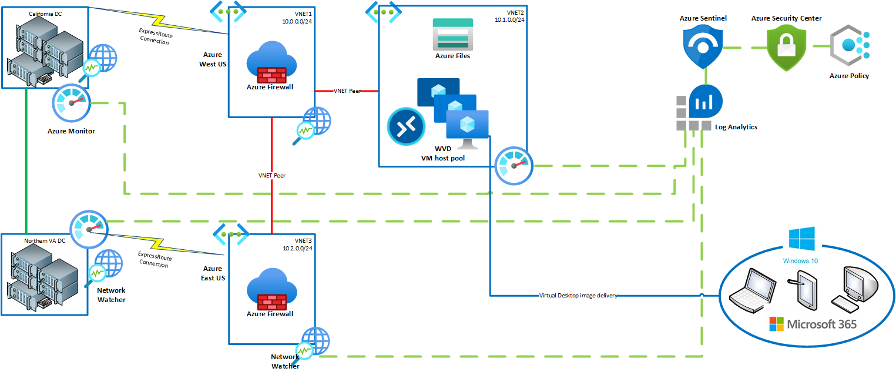
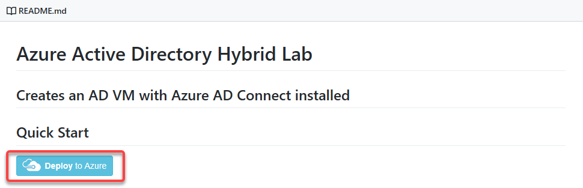
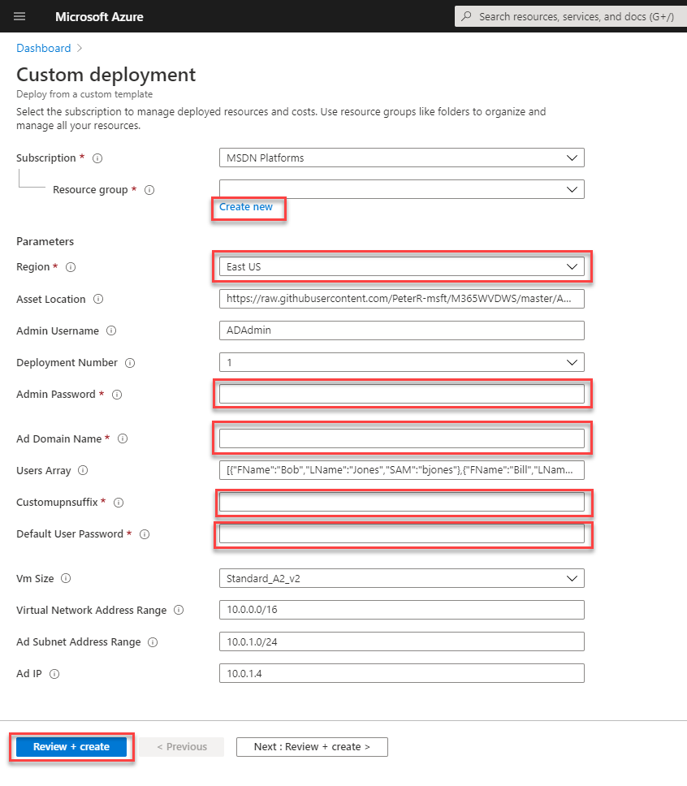

# Step 1: Deploying Azure Infrastrucure and AD DS

Duration:  30 minutes

**Additional Resources**

|                                                             |                                                              |
| ----------------------------------------------------------- | :----------------------------------------------------------: |
| Description                                                 |                            Links                             |
| WVD Overview and Requirements | https://docs.microsoft.com/en-us/azure/virtual-desktop/overview |
| Environmental Terms (Host pools, App groups, Workspaces, Oh My!) | https://docs.microsoft.com/en-us/azure/virtual-desktop/environment-setup |
| Host pool load-balancing methods | https://docs.microsoft.com/en-us/azure/virtual-desktop/host-pool-load-balancing |
| Understanding WVD Network Connectivity | https://docs.microsoft.com/en-us/azure/virtual-desktop/network-connectivity |
| WVD FAQ | https://docs.microsoft.com/en-us/azure/virtual-desktop/faq |
| Windows 10 Enterprise multi-session FAQ | https://docs.microsoft.com/en-us/azure/virtual-desktop/windows-10-multisession-faq |
| Windows Virtual Desktop DOcumentation | https://docs.microsoft.com/en-us/azure/virtual-desktop/ |
|                                                             |                                                              |

## Solution architecture

 

This diagram shows a Windows Virtual Desktop architecture with on-premises servers for Active Directory.  In the diagram, the host pools are providing the WVD session to the different supported devices. Azure Monitor, Network Watcher, and Log Analytics are monitoring and logging activity and performance metrics.

## Requirements

Before you start setting up your Windows Virtual Desktop workspace, make sure you have the following items:

-   The Azure Active Directory tenant ID for Windows Virtual Desktop users.

-   A global administrator account within the Azure Active Directory tenant.

    -   This also applies to Cloud Solution Provider (CSP) organizations that are creating a Windows Virtual Desktop workspace for their customers. If you are in a CSP organization, you must be able to sign in as global administrator of the customer\'s Azure Active Directory tenant.

    -   The administrator account must be sourced from the Azure Active Directory tenant in which you are trying to create the Windows Virtual Desktop workspace. This process does not support Azure Active Directory B2B (guest) accounts.

    -   The administrator account must be a work or school account.

-   An Azure subscription.

    -   Enough Quota Cores to build four 4-core servers.

    -   Access to the Azure Active Directory Global Admin account for your new or existing Azure Active Directory Tenant.

    -   Owner rights on all Azure subscription(s).

### Task 1: Deploying Azure Infrastructure and AD DS

In this task you will leverage a custom Azure Resource Manager (ARM) template to deploy the required Active Directory Domain Services infrastructure for WVD. If you already have an AD DS environment and AD Connect configured, you can move on to **HOL step-by-step, Exercise 4: Configuring Azure AD Connect with AD DS**.

1. Link to the ARM template: [AAD hybrid lab ARM template from GitHub](https://github.com/PeterR-msft/M365WVDWS/tree/master/AAD-Hybrid-Lab).

This ARM Template will provision the following resources:

-   Virtual Network

    -   1 Subnet

    -   1 Network Security Group (NSG)

        -   Permits AD traffic, permits RDP incoming traffic, restricts DMZ access.

    -   DNS configured to point to the domain controller.

-   Virtual Machine

    -   Active Directory Domain Services is installed and configured.

    -   Test users created in the domain.

    -   Azure AD Connect is installed and ready for configuration.

    -   Public IP address assigned for remote administration via RDP.

### Task 2: Deploying the ARM template

>**Tip**: Internally at MSFT we have different tenant directories available. Because of this, it is not uncommon for ARM templates hosted on GitHub to get stuck during
deployment. To avoid confusion and deployment errors, **open an InPrivate browser window** when deploying ARM templates from GitHub.

1.  Open a browser using "InPrivate" or "Incognito" mode, and navigate to the ARM template: [AAD hybrid lab ARM template from GitHub](https://github.com/PeterR-msft/M365WVDWS/tree/master/AAD-Hybrid-Lab).

2.  Review the notes on the GitHub page for the ARM template prior to deployment.

3.  Under Quick Start, click **Deploy to Azure**. This will open a new browser tab to the Azure Portal for custom deployments.
    
    

4.  If prompted, make sure to sign in with an account that is an owner for the Azure subscription.

5.  Fill in the required ARM template parameters. Refer to the following example for more information on the parameters:

    - Create a new **Resource group**
    - Select a **Region**
    - Create an **Admin password**
    - Create an **AD Domain name**, such as **(mycompany).local**
    - Create a **Customupnsuffix** for WVD, such as **"mywvd"**
    - Create a **Default user password**
    - Select **Review + create**

    >**Note**: Make sure that you save these inputs, they will be needed for reference when you go through the HOL Step-by-Step.
    
    

6.  Agree to the Terms and conditions and click **Purchase**.

    The deployment is now underway. On average this process can take 30 minutes to complete. It is important that you monitor the deployment progress to ensure there are no problems. You can monitor progress by clicking the **notification** bell in the upper right corner and clicking **Deployment in progress...**.

    >**Note**: While automation can make things simpler and repeatable, sometimes it can fail. If at any time during the ARM template deployment there is a failure, review the failure, delete the Resource Group and try the ARM template again, adjusting for any possible errors.

    Once the ARM template is done being deployed, the status will change to complete. At this point the domain controller is ready for RDP connectivity.

