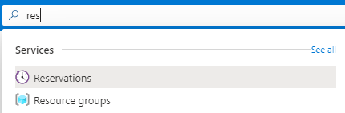

# Step 11: Cleanup

Duration:  20 minutes

| WARNING: When you are finsihed you should remove all resources used for this Workshop.  To do this in the **Azure Portal** click **Resource groups**.  Select any resources groups you have created.  On the resource group blade click **Delete Resource group**, enter the Resource Group Name and click **Delete**.  Repeat the process for any additional Resource Groups you may have created. **Failure to do this may cause unintended charges or other issues.** |
   
### Task 1: Delete Resource groups to remove workshop environment

1. Go to the **Azure portal**.

2. Go to your **Resource groups**.

    

3. Select the **Resource group** that you created your resources.

4. Select **Delete Resource group**.

    

   
5. Enter the name of the **Resource group** and select **Delete**.

    

   
6. Repeat these steps for all **Resource groups** created for this workshop, including those for **Azure Monitor** and **Log Analytics**.
   
