# Step 14: Monitoring and Troubleshooting

Duration:  45 minutes

In this exercise we will setup monitoring for our WVD host pools. There are multiple reasons why monitoring serves a critical role; troubleshooting, performance, security, etc. There are also multiple components that make up the WVD service, which can add some variation on how customers implement monitoring (e.g. adding additional third-party solutions). By the end of this exercise you will have the following monitoring capabilities enabled:

-   Diagnostic logging for the WVD service

-   Azure Monitor for the session host VMs

-   Log Analytics Monitoring Agent for the session host VMs

**Additional Resources**

  |              |            |  
|----------|:-------------:|
| Description | Links |
| Use Log Analytics for diagnostic features | https://docs.microsoft.com/en-us/azure/virtual-desktop/diagnostics-log-analytics |
| Create diagnostic settings to collect resource logs and metrics in Azure |  https://docs.microsoft.com/en-us/azure/azure-monitor/platform/diagnostic-settings |
| PG Blog for Log Analytics Dashboard and Azure Monitor | https://techcommunity.microsoft.com/t5/windows-it-pro-blog/proactively-monitor-arm-based-windows-virtual-desktop-with-azure/ba-p/1508735 |
|Enable monitoring for a single Azure VM |  https://docs.microsoft.com/en-us/azure/azure-monitor/insights/vminsights-enable-single-vm#enable-monitoring-for-a-single-azure-vm |
|Enable Azure Monitor for VMs by using Azure Policy |   https://docs.microsoft.com/en-us/azure/azure-monitor/insights/vminsights-enable-at-scale-policy |
|Enable Azure Monitor for VMs using Azure templates |  https://docs.microsoft.com/en-us/azure/azure-monitor/insights/vminsights-enable-at-scale-powershell |
  |              |            |

### Task 1: Create a Log Analytics workspace

>**Note: If you created a LogAnalytics workspace during Scale Session Hosts Automatially you may re-use this workspace.

A Log Analytics workspace is required for each of the monitoring capabilities covered in this exercise. You have the option to stream log data into different workspaces if desired. There are several factors to consider around a single workspace versus multiple. For example, RBAC controls, query performance, report development, etc. For WVD
environments, it is common to have all monitor data pointing to a single dedicated workspace.

In this exercise we will create a dedicated workspace for our environment. If you already have a workspace created, move on to Task 2.

1.  Sign in to the [Azure Portal](https://portal.azure.com/).

2.  At the top of the page, in the **Search resources** field, type \"**log analytics**\". Select **Log Analytics workspaces** from the list.

    

3.  On the Log Analytics workspaces blade, Select **+Add**.

    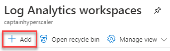

4.  On the Create Log Analytics workspace blade, fill in the following information and Select **Review + Create**.

    -    **Subscription:** Select the desired subscription for the Log Analytics workspace.

    -    **Resource Group:** Create a new resource group or select one from the list.

    -    **Name:** Enter a unique name for the workspace.

    -    **Region:** Select a region for the workspace.

5.  Select **Create**.

    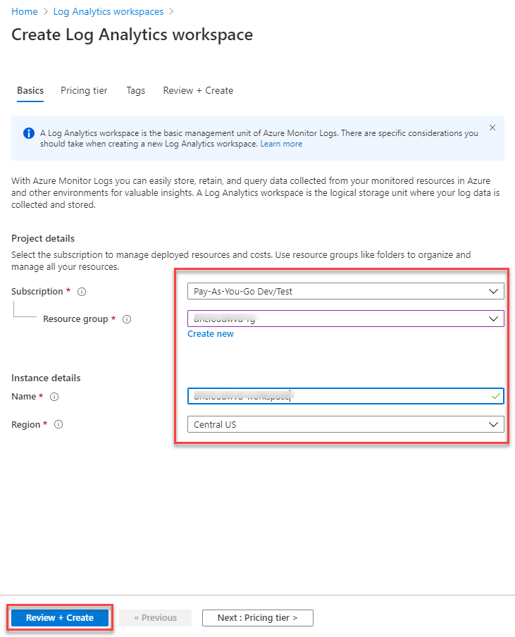

Monitor the notification bell in the upper-right corner and wait for the deployment to complete. Once complete, move on to task 2.

### Task 2: Enabling diagnostic logging for WVD

Like many other Azure services, WVD uses Azure Monitor for monitoring and alerts. In order to enable diagnostic data collection, you need to enable it for each ARM object that you want to monitor (e.g. Host pools, Application groups, and Workspaces). Once enabled, it can take a few hours for the data to appear in your workspace.

Each WVD ARM object has different diagnostic data categories available. For example, host pool objects will have a different set of options then Workspaces. Refer to the following table for a summary of each data category and their associated objects.

  |              |            |     |
|----------|:-------------:|:-------------:|
| **Category**  |**Description**  |                                                                 **ARM Object(s)** |
  Checkpoint   |       Specific steps in the lifetime of an activity that were reached. For example, during a session, a user was load balanced to a particular host, then the user was signed on during a connection, and so on. |  Host pools, Application groups, Workspaces
  Connection    |      When users initiate and complete connections to the service.    |                                                                                                                                             Host pools
  Error       |        Are users encountering any issues with specific activities? This feature can generate a table that tracks activity data for you as long as the information is joined with the activities.     |               Host pools, Application groups, Workspaces |
  Feed   |             Can users successfully subscribe to workspaces? Do users see all resources published in the Remote Desktop client?      |                                                                                     Workspaces |
  Host Registration  | Was the session host successfully registered with the service upon connecting?       |                                                                                 Host pools| 
  Management     |     Track whether attempts to change Windows Virtual Desktop objects using APIs or PowerShell are successful. For example, can someone successfully create a host pool using PowerShell?       |                  Host pools, Application groups, Workspaces

### Task 3: Enable logging for host pools

1.  Sign in to the [Azure Portal](https://portal.azure.com/).

2.  At the top of the page, in the **Search resources** field, type \"**windows virtual desktop**\". Select **Windows Virtual Desktop** from the list.

    

3.  On the Windows Virtual Desktop blade, under **Manage**, select **Host pools**.

4.  On the Windows Virtual Desktop \| Host pools blade, locate a host pool and Select on the name.

5.  On the blade for your host pool, under **Monitoring**, select **Diagnostic settings**.

6.  On the Diagnostics settings blade, Select **+Add diagnostic setting**.

    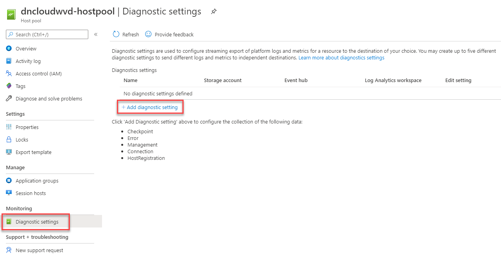

7.  On the Diagnostic settings page, fill in the following information and Select **Save**.

    -    **Diagnostic settings name:** Enter a name for these settings. ARM objects can have multiple diagnostic settings applied.

    -    **Category details \| log:** Check the box for the logs that you want to collect.

    -    **Destination details \| Send to Log Analytics:** Check this box.

         - **Subscription:** Select the desired subscription.

         - **Log Analytics workspace:** Select the desired workspace.

    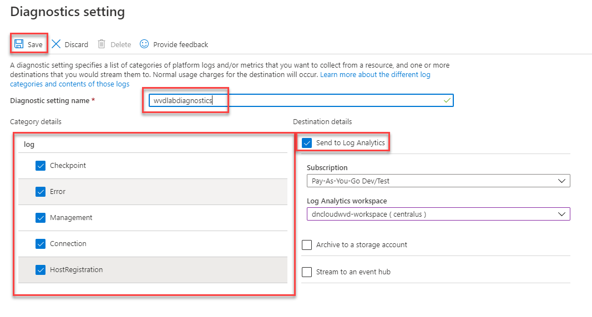

### Task 4: Enable logging for application groups

1.  Sign in to the [Azure Portal](https://portal.azure.com/).

2.  At the top of the page, in the **Search resources** field, type \"**windows virtual desktop**\". Select **Windows Virtual Desktop** from the list.

    

3.  On the Windows Virtual Desktop blade, under **Manage**, select **Application groups**.

4.  On the Windows Virtual Desktop \| Application groups blade, locate an application group and Select on the name.

5.  On the blade for your application group, under **Monitoring**, select **Diagnostic settings**.

6.  On the Diagnostics settings blade, Select **+Add diagnostic setting**.

    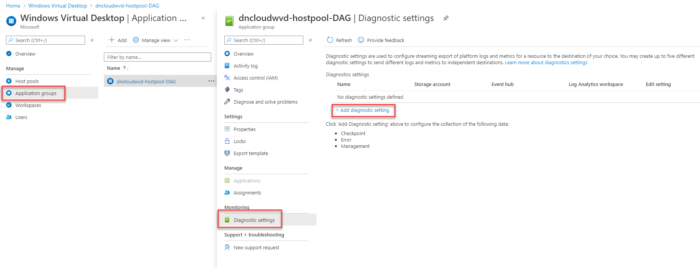

7.  On the Diagnostic settings page, fill in the following information and Select **Save**.

    -    **Diagnostic settings name:** Enter a name for these settings. ARM objects can have multiple diagnostic settings applied.

    -    **Category details \| log:** Check the box for the logs that you want to collect.

    -    **Destination details \| Send to Log Analytics:** Check this box.

            - **Subscription:** Select the desired subscription.

            - **Log Analytics workspace:** Select the desired workspace.

    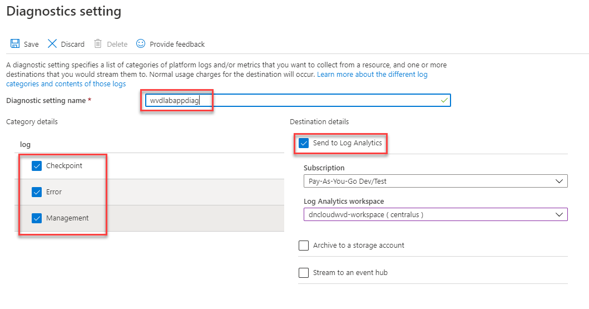

### Task 5: Enable logging for workspaces

1.  Sign in to the [Azure Portal](https://portal.azure.com/).

2.  At the top of the page, in the **Search resources** field, type \"**windows virtual desktop**\". Select **Windows Virtual Desktop** from the list.

    

3.  On the Windows Virtual Desktop blade, under **Manage**, select **Workspaces**.

4.  On the Windows Virtual Desktop \| Workspaces blade, locate a workspace and Select on the name.

5.  On the blade for your workspace, under **Monitoring**, select **Diagnostic settings**.

6.  On the Diagnostics settings blade, Select **+Add diagnostic setting**.

    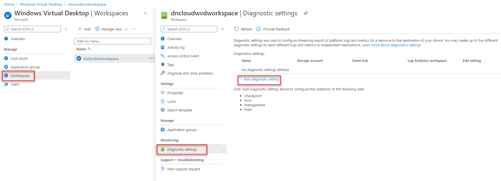

7.  On the Diagnostic settings page, fill in the following information and Select **Save**.

    -    **Diagnostic settings name:** Enter a name for these settings. ARM objects can have multiple diagnostic settings applied.

    -    **Category details \| log:** Check the box for the logs that you want to collect.

    -    **Destination details \| Send to Log Analytics:** Check this box.

            -    **Subscription:** Select the desired subscription.

            -    **Log Analytics workspace:** Select the desired workspace.

    

At this point you should have diagnostic data enabled on at least 1 WVD ARM object of each type. To enable monitoring for additional objects, rinse and repeat the above steps.

### Task 6: Enabling Azure Monitor for the session hosts

Azure Monitor is leveraged with WVD to monitor the performance and health of your session host VMs. This feature can be enabled for Azure VMs in a number of ways. In this exercise we will walk through enabling Azure Monitor on VMs using the Azure portal. Refer to the following links for guidance on automation.

1.  Sign in to the [Azure Portal](https://portal.azure.com/).

2.  At the top of the page, in the **Search resources** field, type \"**virtual machines**\". Select **Virtual Machines** from the list.

    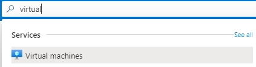

3.  On the Virtual Machines blade, locate a session host VM and Select on the name.

4.  On the blade for the virtual machine, under **Monitoring**, select **Insights**.

    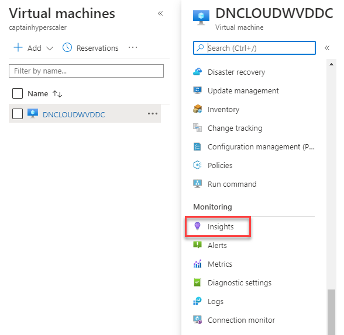

5.  On the Insights blade, Select **Enable**. This will initiate a validation check.

    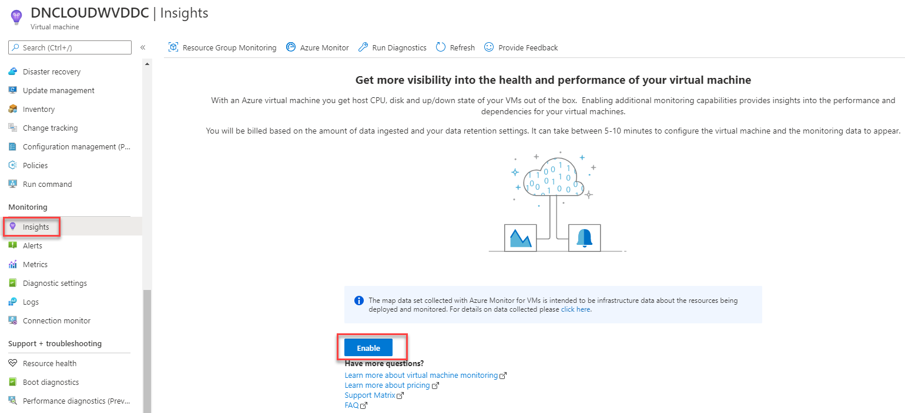

    >**Note**: The virtual machine must be running to enable Azure Monitor.

6.  On the Insights setup page, fill in the following information and Select **Enable**.

    -    **Workspace Subscription:** Select the desired subscription.

    -    **Choose a Log Analytics Workspace:** Select the workspace used in the previous task.

    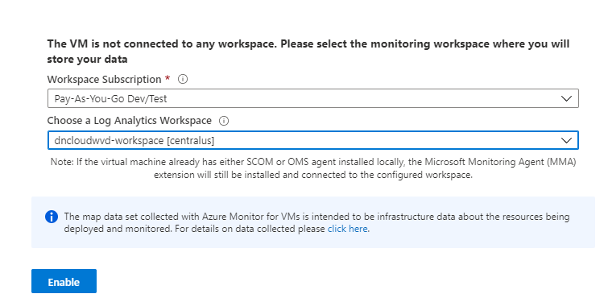

Monitor the notification bell in the upper-right corner and wait for the deployment to complete. This can take 5-10 minutes. Once complete, you will see the following items configured on the VM:

**New VM Extensions Added**. Two new extensions are added to the VM Extensions blade in Azure.

**New Monitoring Agents Installed**. Two new agents are installed on the VM.

**Monitoring Agent Configured for Log Analytics** The Microsoft Monitoring Agent is configured for your log analytics workspace.

At this point you should have Azure Monitor enabled on at least one session host VM. To enable Azure Monitor for additional session hosts, repeat the above steps. For automation, leverage Azure Policy or PowerShell to enable monitoring on multiple VMs.

**Example Kusto Queries**

For a list of example queries, refer to the following Docs article:

[**Use Log Analytics for the diagnostics feature \| Example queries**](https://docs.microsoft.com/en-us/azure/virtual-desktop/diagnostics-log-analytics#example-queries) 

**Troubleshooting**

- Go to your Log Analytics workspace, and then select **Logs**. The example query UI is shown automatically.
- Change the filter to **Category**.
- Select **Windows Virtual Desktop** to review available queries.
- Select **Run** to run the selected query.

Often during the deployment of WVD there may be challenges with either having machines join the domain or installing the agent via automation.
