## Step 2: Configuring Azure AD Connect with AD DS

Duration:  60 minutes

In this exercise you will be configuring [Azure AD Connect](https://docs.microsoft.com/en-us/azure/active-directory/hybrid/whatis-azure-ad-connect). With Windows Virtual Desktop, all session host VMs within the WVD tenant environment are required to be domain joined to AD DS, and the domain must be synchronized with Azure AD. To manage the synchronization of objects, you will configure Azure AD Connect on the domain controller deployed in Azure.

>**Note**: RDP access to a domain controller using a public IP address is not a best practice and is only done to simplify this lab. Better security practices such as removing the PIP, enabling just-in-time access and/or leveraging a bastion host should be applied enhance security.

**Additional Resources**

|                                                             |                                                              |
| ----------------------------------------------------------- | :----------------------------------------------------------: |
| Description                                                 |                            Links                             |
| Windows Virtual Desktop Spring Update enters Public Preview | https://techcommunity.microsoft.com/t5/itops-talk-blog/windows-virtual-desktop-spring-update-enters-public-preview/ba-p/1340245 |
| ARM-based model public preview) deployment walk through     | https://www.christiaanbrinkhoff.com/2020/05/01/windows-virtual-desktop-technical-2020-spring-update-arm-based-model-deployment-walkthrough/#NewAzurePortal-Dashboard |
|                                                             |                                                              |

### Task 1: Connecting to the domain controller

1. Sign in to the [Azure Portal](https://portal.azure.com/).

2. Type **Resource groups** in the search field and select it from the list.

3. On the Resource groups blade, Select on the resource group name that you created in the **Before the HOL** template deployment.

4. On the Infra Resource group blade, review the list of available resources. Locate the resource named **AdPubIP1** and Select on it. Note that the resource type should be **Public IP address**.

   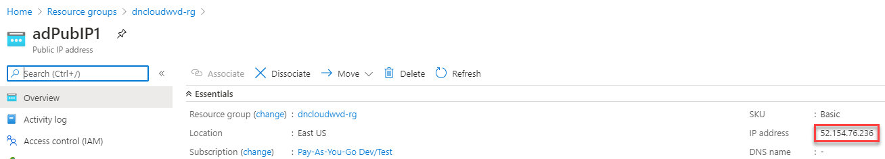

5. On the Overview page for AdPubIP1, locate the **IP address** field. Copy the IP address to a safe location.

6. On your local machine, open the **RUN** dialog window, type **MSTSC** and hit enter.

   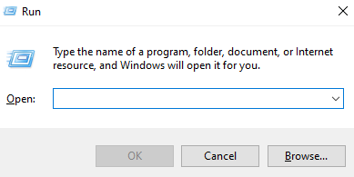 

7. In the **Remote Desktop Connection** window, paste in the public IP address from the previous step. Select **Connect**.

    

8. When prompted, sign in with the AD domain UPN credentials. For example, if you used the ARM template from step 1, the credentials will be something along the lines of: [adadmin\@MyADDomain.com](mailto:adadmin@MyADDomain.com) with the password you specified whlie deploying the teamplte. If prompted, Select **Yes** to accept the RDP certification warning.

   >**Note**: This is the Active Directory account from the ARM template, not the Azure AD Global Admin account. If you have trouble signing in, try typing the credentials in manually, as copy and paste may include an unnecessary space, which will cause authentication to fail.

### Task 2: Disabling IE Enhanced Security

In an effort to simplify tasks in this lab, we will start by disabling [IE Enhanced Security](https://docs.microsoft.com/en-us/windows-hardware/customize/desktop/unattend/microsoft-windows-ie-esc).

1. Once connected to the domain controller, open Server Manager if it does not start automatically.

2. In Server Manager, select **Local Server** on the left.

3. Locate the **IE Enhanced Security Configuration** option and Select **On**.

   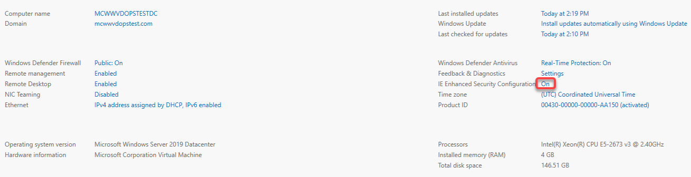 

4. On the Internet Explorer Enhanced Security Configuration window, under **Administrators**, select the **Off** radio button and Select **OK**.

   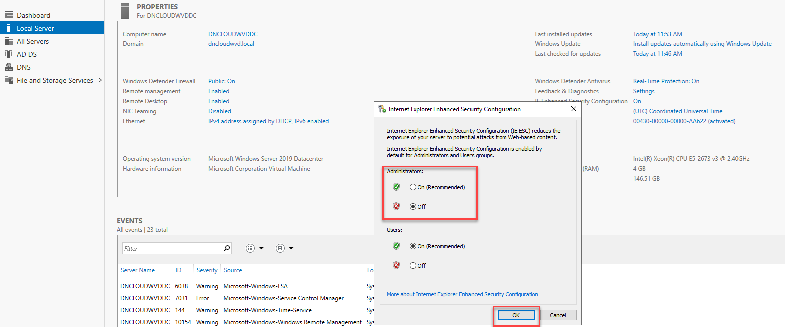

### Task 3: Creating a domain admin account

By default, Azure AD Connect does not synchronize the built-in domain administrator account [ADAdmin\@MyADDomain.com](mailto:ADAdmin@MyADDomain.com). This system account has the attribute isCriticalSystemObject set to *true*, preventing it from being synchronized. While it is possible to modify this, it is not a best practice to do so.

1. In Server Manager, Select **Tools** in the upper right corner and select **Active Directory Users and Computers**.

   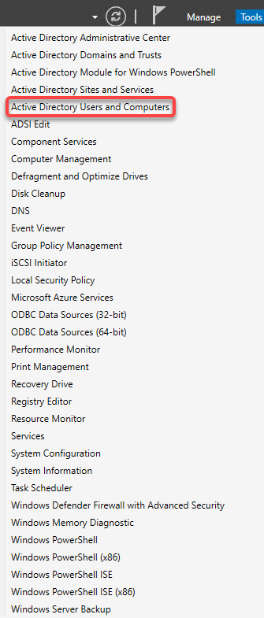 

2. In Active Directory Users and Computers, right-click the **Users** organization unit and select **New \> User** from the menu.

   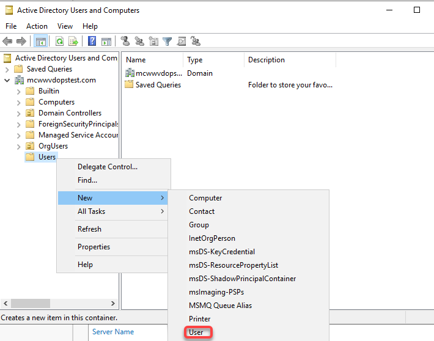 

3. Complete the New User wizard.

   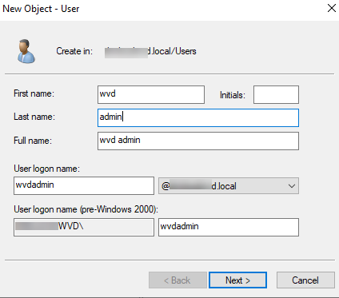

    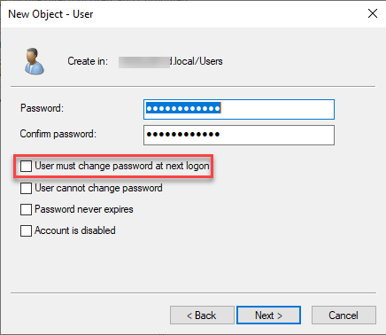 
    
    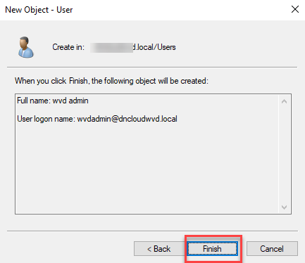
    
    >**Note**: This account will be important in future tasks. Make a note of the username and password you create. When setting the password, uncheck the box **User must change password at next logon**.

4. In Active Directory Users and Computers, right-click on the new user account object and select **Add to a group**.

   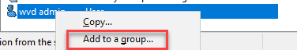

5. On the Select Groups dialog window, type **Domain Admins** and Select **OK**.

   >**Note**: This account will be used during the host pool creation process for joining the hosts to the domain. Granting Domain Admin permissions will simplify the lab. However, any Active Directory account that has the following permissions will suffice. This can be done using [Active Directory Delegate Control](https://danielengberg.com/domain-join-permissions-delegate-active-directory/). 

   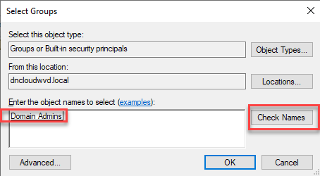

### Task 4: Configuring Azure AD Connect

1. On the desktop of the domain controller, locate the icon for **Azure AD Connect** and open it.

   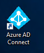

2. Accept the license terms and privacy notice, then select continue. On the next screen select **Use express settings**. The required components will install.

   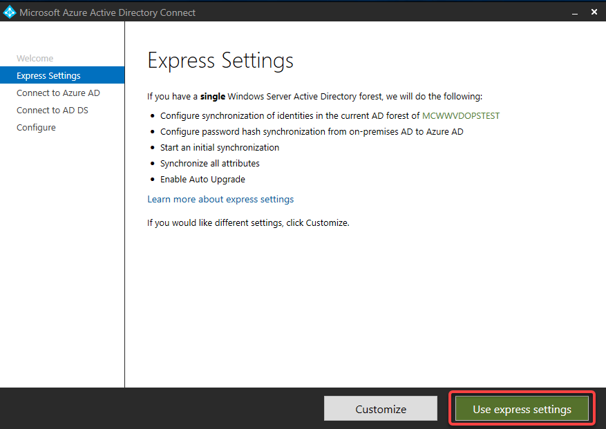 

3. On the Connect to Azure AD page, enter in the Azure AD Global Admin credentials. For example: [azadmin\@MyAADdomain.onmicrosoft.com](mailto:azadmin@MyAADdomain.onmicrosoft.com) and the correct password. Select **Next**.

   

   >**Note**: This is the account associated with your Azure subscription.

4. On the Connect to AD DS page, enter in the Active Directory credentials for a Domain Admin account. For example, if you used the ARM template deployment for the domain controller, the credentials will be something along the lines of: **[[MyADDomain.com]](http://myaddomain.com/) \\ADadmin** using the password you specified whlie deploying the teamplte. Select **Next**.

   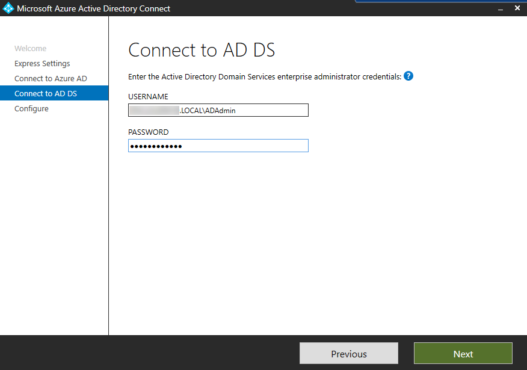

   >**Note**: If you copy and paste the password, please ensure that there are no trailing spaces, as that will cause the verification to fail.

5. Select **Install** to start the configuration and synchronization.

   

   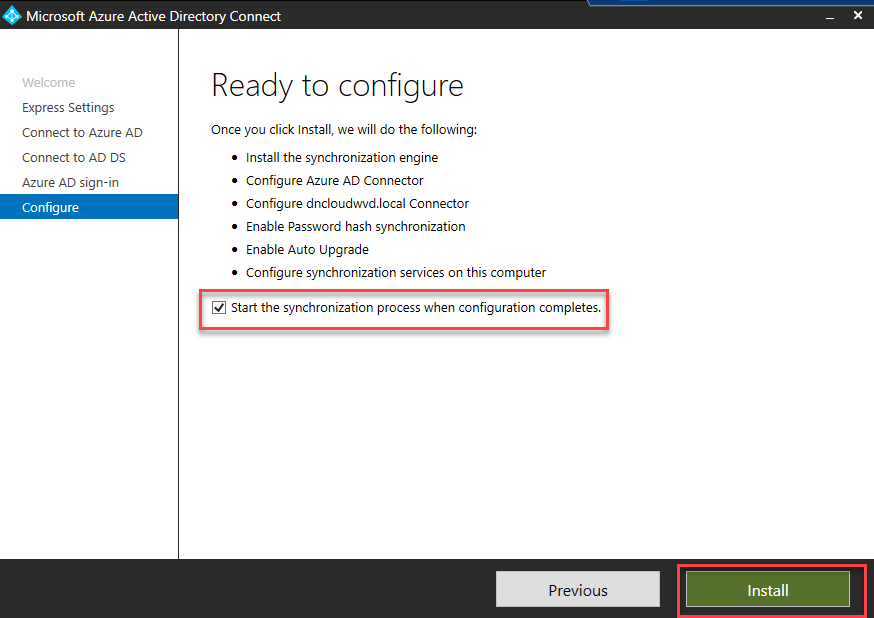

6. After a few minutes the Azure AD Connect installation will complete.
   Select **Exit**.

   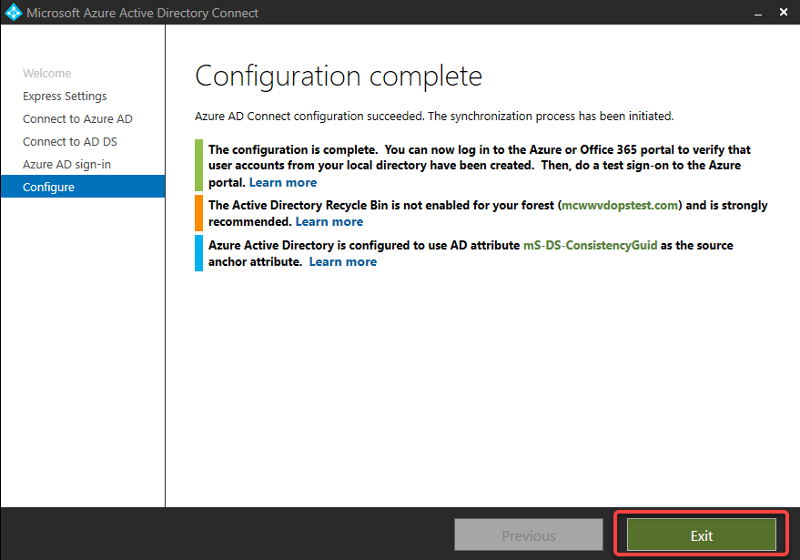

7. Minimize the RDP session for the domain controller and wait a few minutes for the AD accounts to be synchronized to Azure AD.

8. Sign in to the [Azure Portal](https://portal.azure.com/).

9. Type **Azure Active Directory** in the search field and select it from the list.

10. On the Azure Active Directory blade, under **Manage**, select **Users**.

11. Review the list of user account objects and confirm the test accounts have synchronized.  

    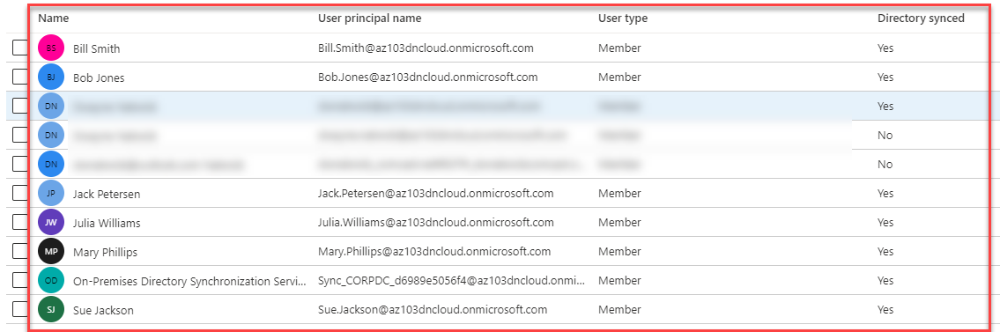

    >**Note**: It can take up to 15 minutes for the Active Directory objects to be synchronized to the Azure AD tenant.

## 