# Step 4: FSLogix Setup

Duration:  45 minutes

>**Note: This step should be considered optional but highly reccomended. If you feel that you are behind or might become behind you can do this step at the end. If you choose not to perform this activity in order you will not have the proper fslogix data for the next step, creating a master image. You will be able to proceed, however you may be asked for this data in the next step. You may leave the portion pertaining to FSlogix blank.

In this exercise you will be creating an Azure File share and enabling SMB access via Active Directory authentication. Azure Files is a platform service (PaaS) and is one of the recommended solutions for hosting FSLogix containers for WVD users. At the end of this exercise you will have the following components:

-   A new storage account in your Azure subscription.

-   A new Azure file share for your FSLogix profile containers.

-   AD authentication enabled for your Azure storage account.

-   Permissions applied for user access to the file share.

**Additional Resources**

|              |            |
|----------|:-------------:|
| Description | Links |
| Windows File Server |https://docs.microsoft.com/en-us/azure/virtual-desktop/create-host-pools-user-profile|
|NetApp Files|https://docs.microsoft.com/en-us/azure/virtual-desktop/create-FSLogix-profile-container |
|Azure Files | https://docs.microsoft.com/en-us/azure/virtual-desktop/create-profile-container-adds |
|              |            |

### Task 1: Create a storage account

Before you can work with an Azure file share, you need to create an Azure storage account. To create a general-purpose v2 storage account in the Azure portal, follow these steps:

1.  Sign in to the [Azure Portal](https://portal.azure.com/).

2.  At the top of the page, in the **Search resources** field, type **storage accounts**. Select **Storage accounts** from the list.

    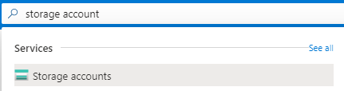

3.  On the Storage Accounts window that appears, Select **+ Add**.

4.  Fill in the required parameters for the storage account. Refer to the following example for more information on the available parameters. Make a note that contains the values you provide for **Resource group** and **Storage account name**. These will be needed later in the exercise.  Please make sure your storage acount name is 15 characters or less

    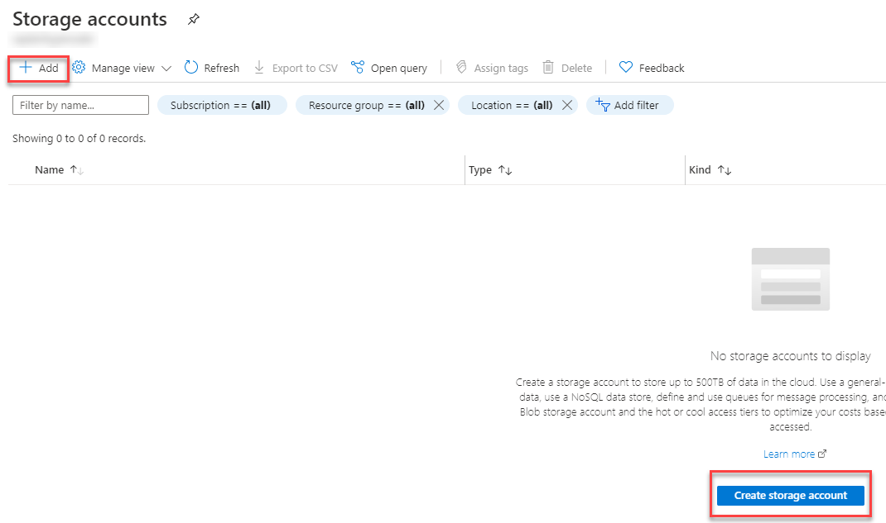

    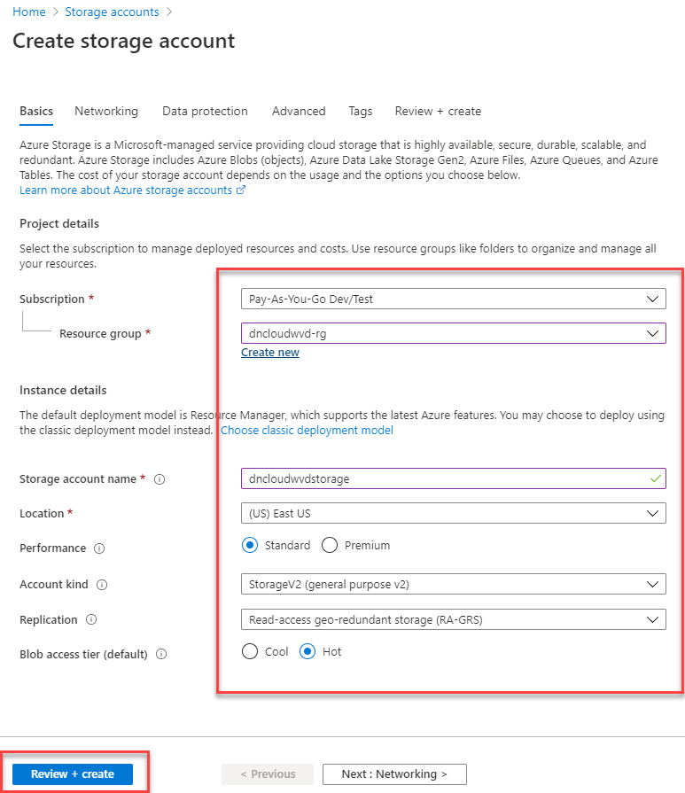

5.  Select **Review + Create** to review your storage account settings and create the account.

6.  Select **Create**.

### Task 2: Create an Azure file share

1.  At the top of the Azure Portal page, in the **Search resources** field, type **storage accounts**. Select **Storage accounts** from the list.

2.  On the Storage accounts blade, Select on the storage account you created in Task 1.

3.  On the Overview page for your Storage account, select **File shares**.

    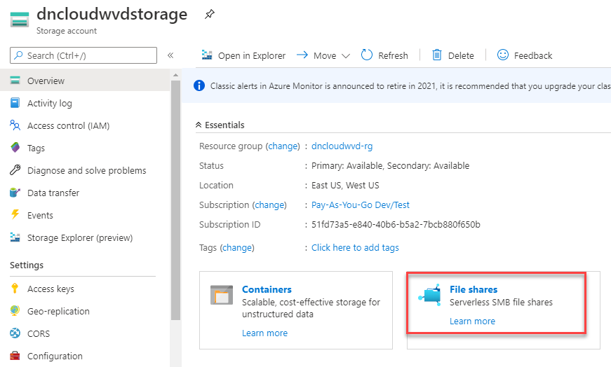

4.  On the File shares blade, Select **+ File Share**.

    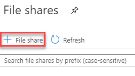

5.  Enter a Name the new file share, enter a quota in gigabits, select **Hot** Tier,and Select **Create**.

    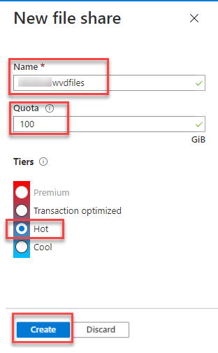
    
    >**Note**: The file share quota supports a maximum of 5,120 GiB and can be managed on the File shares blade.

### Task 3: Enable AD authentication for your storage account

**Prerequisites**

1.  The steps in this task need to be completed from a domain joined computer. The **AzFilesHybrid** module uses the AD PowerShell module, so running from a server is preferred.

    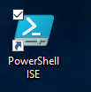

2.  The account used in this task needs to meet the following requirements:

    -    Synchronized with Azure AD.

    -    Permissions to create user or computer objects in Active Directory.

    -    Owner or Contributor rights on the Storage account.

In this task we will be completing the steps on the Domain Controller in Azure using an account that has been assigned Global Administrator and Domain Administrator. In a production environment, you can scale this back as long as you meet the minimum requirements above.

**Setup**

1.  From a domain joined computer, download and unzip the [AzFilesHybrid module](https://github.com/Azure-Samples/azure-files-samples/releases).

    **Link address**: https://github.com/Azure-Samples/azure-files-samples/releases   

    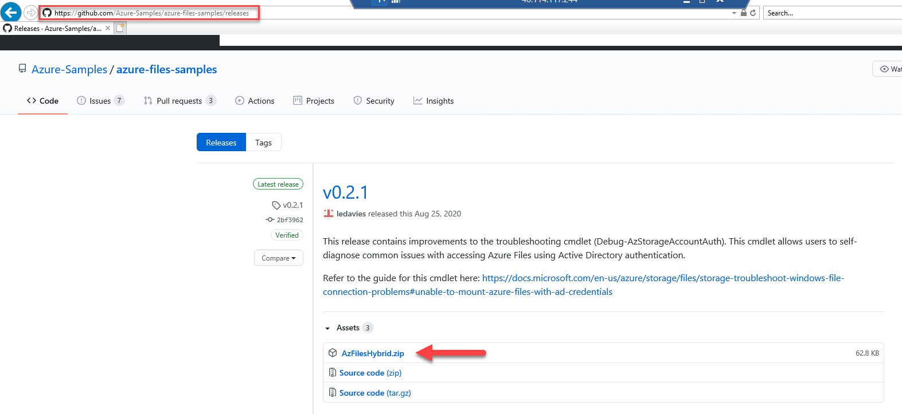

2. From the GitHub repository, select and download the AzFilesHybrid.zip file to the domain joined computer **Documents** folder.

    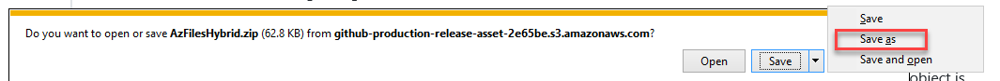

    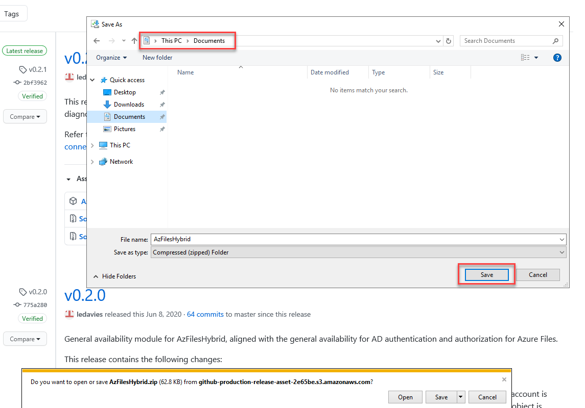

3. After the download is complete, navigate to the file location in file explorer.

    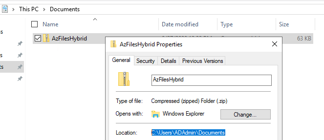

4. Extract this file to the **Documents** folder on the local Domain controller.

    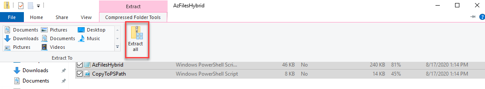

    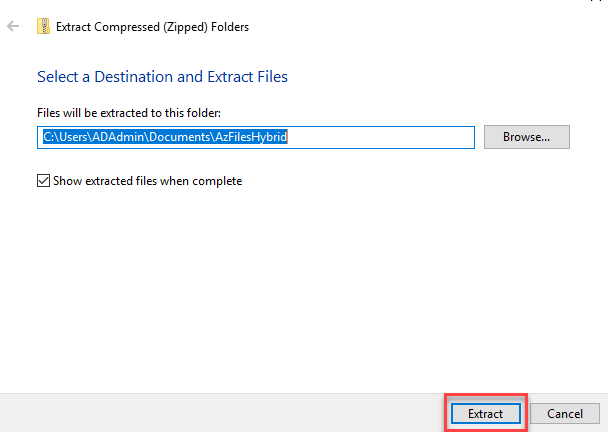

5.  Open an elevated PowerShell ISE window by finding the **PowerShell ISE** icon on the desktop. Right-click on the icon and select **Run as administrator**.

    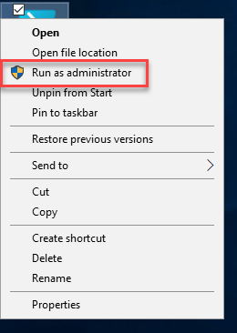

6.  Configure the PowerShell execution policy **Unrestricted** for the current user.

    ```
     Set-ExecutionPolicy -ExecutionPolicy Unrestricted -Scope CurrentUser
    ```

7.  Navigate to where you unzipped the AzFilesHybrid. For example:

    ```
    cd C:\Users\ADAdmin\Documents\AzFilesHybrid
    ```

    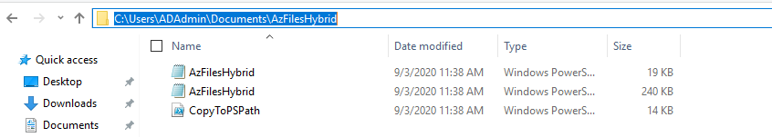

8.  Install the Az PowerShell module.

    ```  
    if ($PSVersionTable.PSEdition -eq 'Desktop' -and (Get-Module -Name AzureRM -ListAvailable)) {
    Write-Warning -Message ('Az module not installed. Having both the AzureRM and ' +
      'Az modules installed at the same time is not supported.')
    } else {
    Install-Module -Name Az -AllowClobber -Scope CurrentUser
    }
    ```

9.  Install the AzFilesHybrid module.

    ```
    .\CopyToPSPath.ps1
    ```

10. Import the AzFilesHybrid module.

    ```  
    Import-Module -Name AzFilesHybrid
    ```

    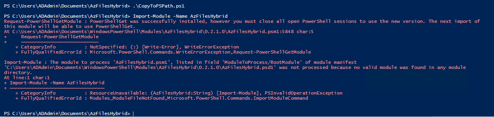
    
11. Sign in with an account that meets the prerequisites.

    ```
    Connect-AzAccount
    ```

12.  Create the following PowerShell variables replacing the subscription id, resource group name, and storage account with the information specific to your lab environment:


        ```
        $SubscriptionId = "<subscription-id>"
        $ResourceGroupName = "<resource-group-name>"
        $StorageAccountName = "<storage-account-name>"
        ```


        >**Note**: The Resource Group Name and Storage Account Name were assigned in Task 1.
    
        >**Note**: You can run **Get-AzSubscription** to lookup the available subscription names.
    
        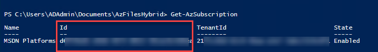


13.  Select the target subscription for the current session.


        ```
        Select-AzSubscription -SubscriptionId $SubscriptionId
        ```

14. Register the storage account with your Active Directory domain.

    ```
    Join-AzStorageAccount -ResourceGroupName $ResourceGroupName
      
    ```

    >**Note**: You will be prompted to enter the Azure storage account name after you run this command.  The prompt will look like the below screenshot.

    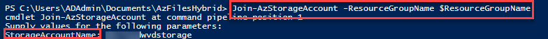

15. When the script completes, you will be provided with confirmation that you are connected to the storage account.

    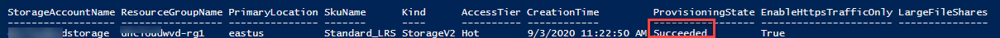

16. Confirm the object was created successfully in **Active Directory Users and Computers** by going to Domain controllers and looking for the computer object for Azure storage account.

    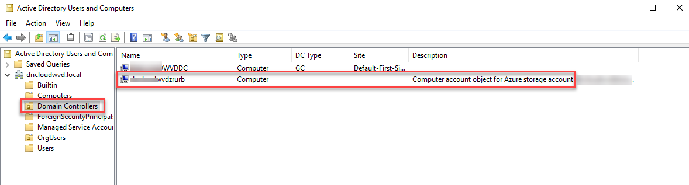

17. Confirm that the feature is enabled.

        ```
        $storageaccount = Get-AzStorageAccount -ResourceGroupName $ResourceGroupName -Name $StorageAccountName
        ```

18.  List the directory service of the selected service account.

        ```
        $storageAccount.AzureFilesIdentityBasedAuth.DirectoryServiceOptions
        ```

19. List the directory domain information if the storage account has enabled AD authentication for file shares.

    ```
    $storageAccount.AzureFilesIdentityBasedAuth.ActiveDirectoryProperties
    ```

    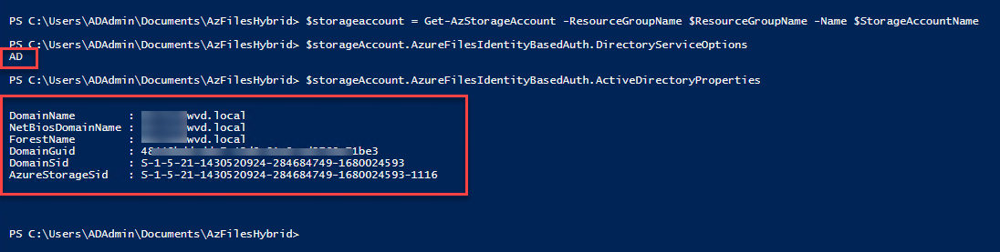


20. You can also confirm activation with your domain by navigating to the Azure portal, going to the storage account and selecting **Configuration** under **Settings**. Refer to the group on Active Directory (AD), as shown in the example below.

    

You have now successfully enabled AD authentication over SMB and assigned a custom role that provides access to an Azure file share with an AD identity.

### Task 4: Configure share permissions

There are three Azure built-in roles for granting share-level permissions to users and/or groups:

-   **Storage File Data SMB Share Reader:** allows read access in Azure Storage file shares over SMB.

-   **Storage File Data SMB Share Contributor:** allows read, write, and delete access in Azure Storage file shares over SMB.

-   **Storage File Data SMB Share Elevated Contributor:** allows read, write, delete and modify NTFS permissions in Azure Storage file shares over SMB.

To access Azure Files resources with identity-based authentication, an identity (a user, group, or service principal) must have the necessary permissions at the share level. This process is similar to specifying Windows share permissions, where you specify the type of access that a particular user has to a file share. The guidance in this task demonstrates how to assign read, write, or delete permissions for a file share to an identity.

To simplify administration, create 4 new security groups in Active Directory to manage share permissions.

1.  From a domain joined computer, open **Active Directory Users and Computers**.

    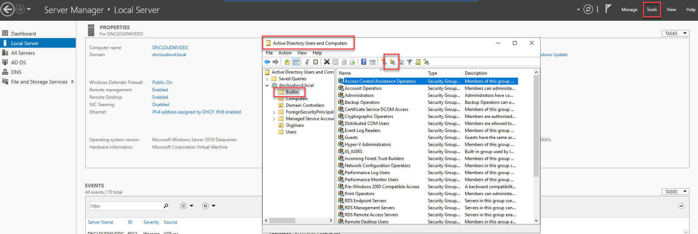

2.  Create the following Active Directory security groups in an OU that is synchronized with Azure AD:

    -   **AZF FSLogix Contributor**

        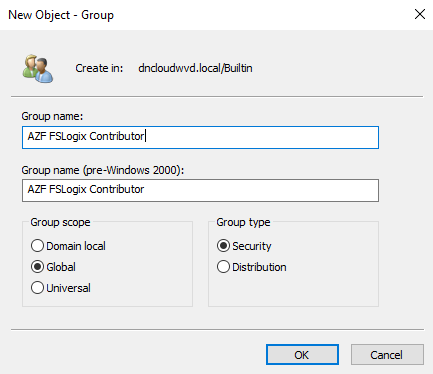

    -   **AZF FSLogix Elevated Contributor**

        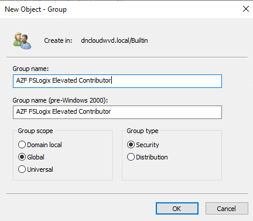

    -   **AZF FSLogix Reader**

        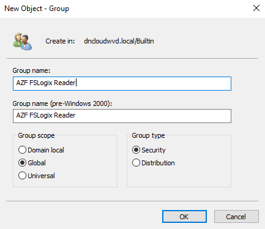

    -   **WVD Users**

        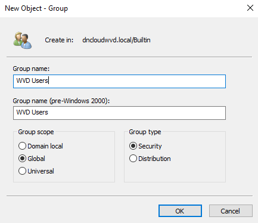

3.  Add the WVD administrative account that you created previously to the group **AZF FSLogix Elevated Contributor**. This account will have permissions to modify file share permissions.

    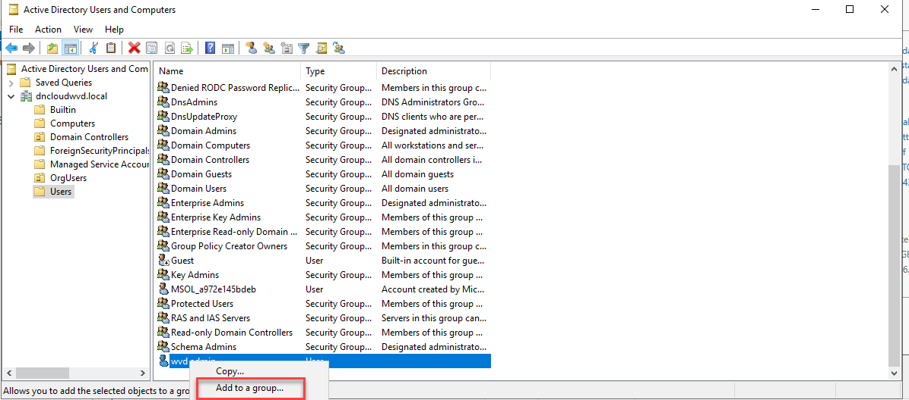

4.  Type **AZF FSLogix Elevated Contributor** and select **Check Names** to verify. Select **Ok** to save.

    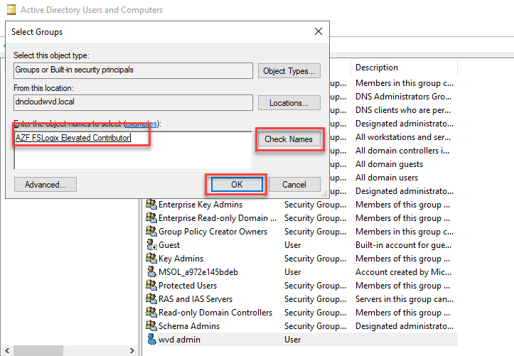

5.  Add the group **WVD Users** to the group **AZF FSLogix Contributor** by going to the Builtin groups, locating WVDUsers and right-click to **Add to a group**.
  
    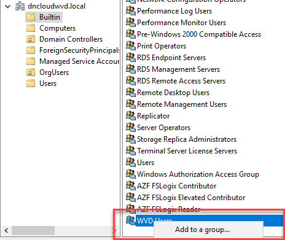

    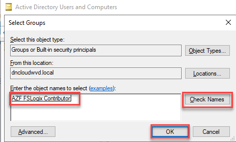

6.  Add user accounts to the group **WVD Users** by selecting **OrgUsers** and choosing all of the users in the list.  Select all of the users and right-click to add them to a group. These users will have access to use FSLogix profiles. Also be sure to add the **ADAdmin** user to these groups.

    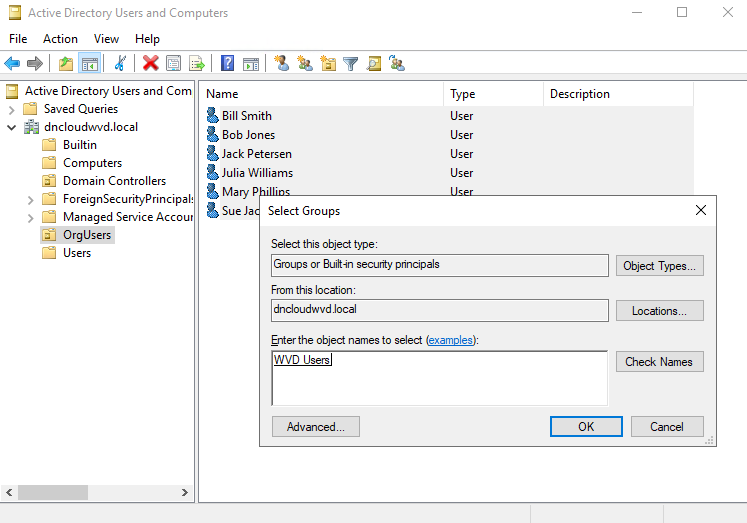

7.  Wait for the new groups to synchronize with Azure AD.  These groups can be verified by going to **Groups** within **Azure Active Directory** and looking for the names in the list.

    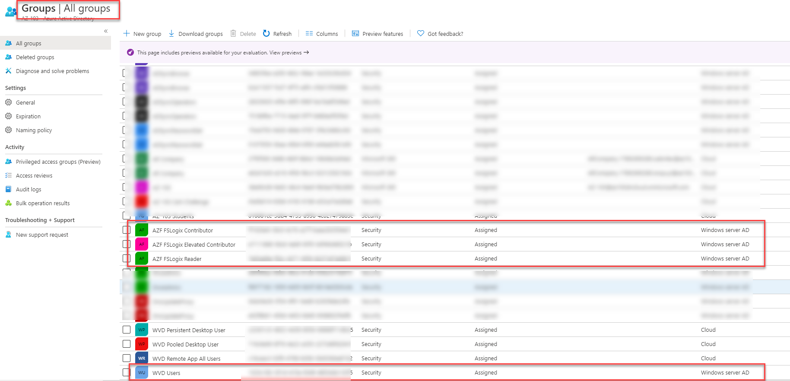

    With the new security groups available in Azure AD, use the following steps to assign them to your storage account in the Azure portal. This will enable to manage share permissions using AD security groups.

8.  In the Azure portal, in the **Search resources** field, type **storage accounts** and select **Storage accounts** from the list.

    

9.  On the Storage accounts blade, Select on the Storage account you created in Task 1.

10. On the blade for your storage account, locate and Select on **File shares** .

11. On the File shares blade, Select on your file share.

12. Select **Access Control (IAM)**.

13. Under **Grant Access to this Resources** click **Add**.

  
14. On the Add role assignment fly out, fill in the following options and Select **Save**.

    -    **Role:** Storage File Data SMB Share Contributor

    -    **Assign access to:** Azure AD user, group, or service principal

    -    **Select:** AZF FSLogix Contributor

    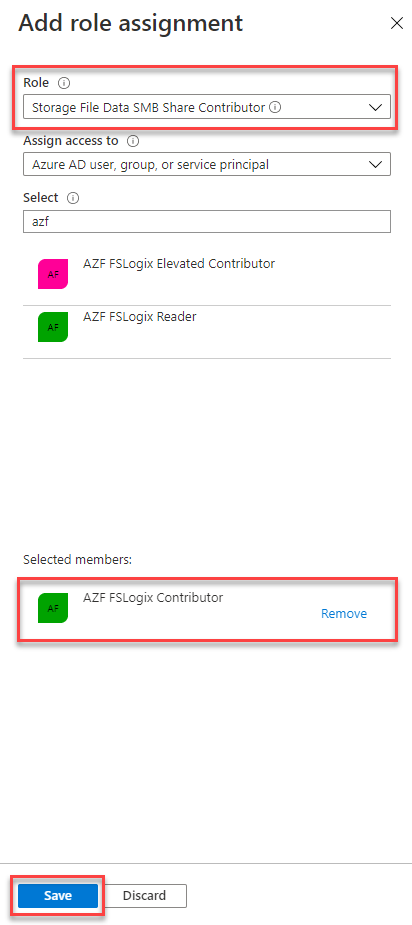

15. Repeat steps 3-4 for the remaining two roles.

    -    Storage File Data SMB Share Elevated Contributor \> AZF FSLogix Elevated Contributor

    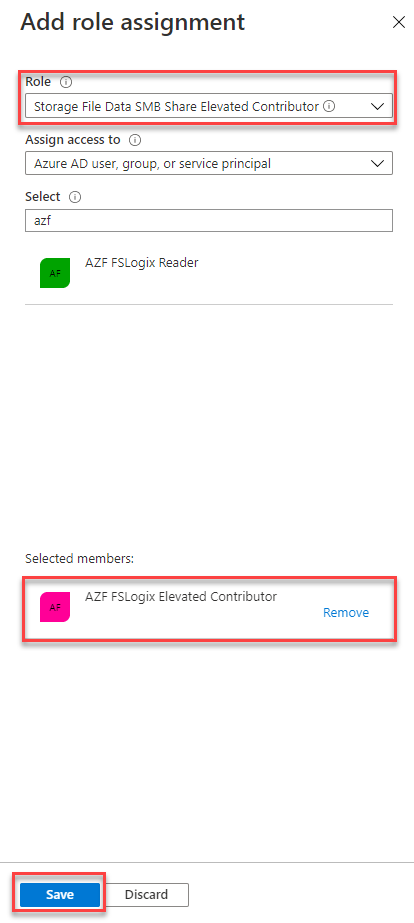

    -    Storage File Data SMB Share Reader \> AZF FSLogix Reader

    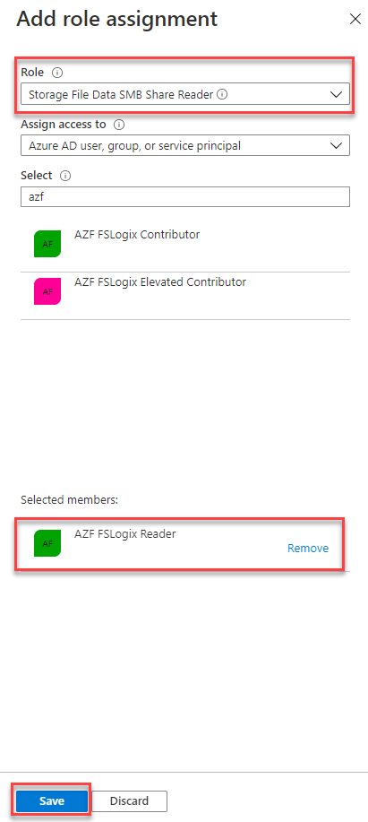

### Task 5: Configure NTFS permissions for the file share

After you assign share-level permissions with Azure RBAC, you must assign proper NTFS permissions at the root, directory, or file level. Think of share-level permissions as the high-level gatekeeper that
determines whether a user can access the share. Whereas NTFS permissions act at a more granular level to determine what operations the user can do at the directory or file level.

Azure Files supports the full set of NTFS basic and advanced permissions. You can view and configure NTFS permissions on directories and files in an Azure file share by mounting the share and then using Windows File Explorer or running the Windows icacls or Set-ACL command.

The first time you configure NTFS permission, do so using superuser permissions. This is accomplished by mounting the file share using your storage account key.

>**Note**: In order to complete this task, you will need to disable secure transfer in the storage account.  This can be accessed from the storage account **Configuration** and selecting **Disabled** under **Secure transfer required**.  Select **Save** to save the changes.

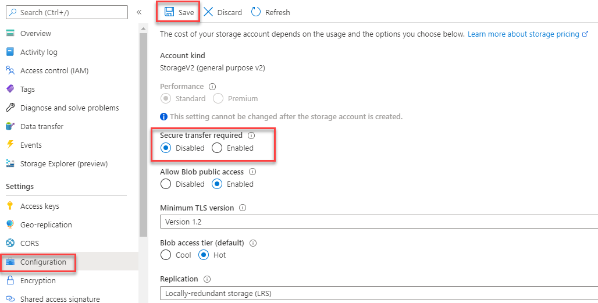

1.  In the Azure portal, in the **Search resources** field, type **storage accounts** and select **Storage accounts** from the list.

2.  On the Storage accounts blade, Select on the Storage account you created in Task 1.

3.  On the blade for your storage account, under **Settings**, select **Properties**. Locate the **Primary File Service Endpoint** address. This is the path you will use to access your file share. 

    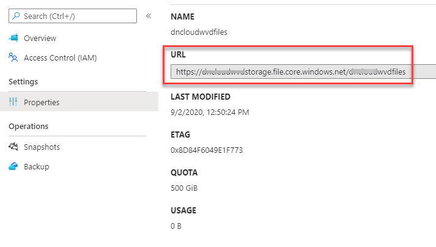

4.  Reformat the path to UNC and copy it to a notepad file. For example:

    https://mydomainazfiles.file.core.windows.net/ ==
    \\\mydomainazfiles.file.core.windows.net\\\<file-share-name\>

    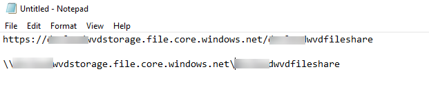

5.  On the blade for your storage account, under **Settings**, select **Access keys**. Copy and paste the value for **key1** to the same notepad file.

    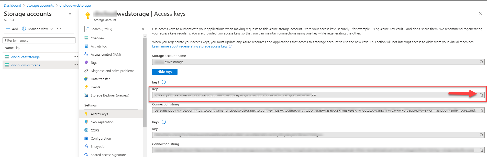

6.  From a domain joined computer, open a standard command prompt and mount your file share using the storage account key. **Do not** use an elevated command prompt or the mount point will not be visible in File Explorer. 

    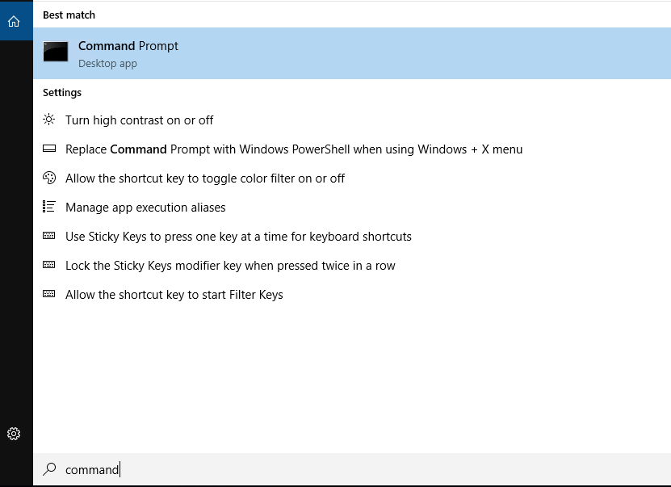
    
    >**Note**: Refer to the following examples to prepare your command. Be sure to enter spaces where (space) is noted:
    net use z:(space) \\\\\<storage-account-name\>.file.core.windows.net\\\<share-name>(space) <storage-account-key\>(space) /user:Azure\\\<storage-account-name\>

        Example:
                
        net use z: \\STORAGE_ACCOUNT_NAME.file.core.windows.net\FILE_SHARE_NAME PASTE_KEY_1_HERE user:Azure\STORAGE_ACCOUNT_NAME
    
 
        Example with sample values:
                
        net use z: \\mydomainazfiles.file.core.windows.net\FSLogix uPCvi+gP2qbCQcn3EATgbALE0H8nxhspyLRO2Nf9Hm2gMxfn/389/M33XHh7YEqNJ2GhbJXgStiifPwMBXk38Q== user:Azure\mydomainazfiles
    

  

    >**Note**: This is an SMB connection on port 445. Most consumer ISPs block this port by default. If you are doing this in your environment and experience issues mounting the share from a local computer, try connecting from a domain joined VM in Azure.

    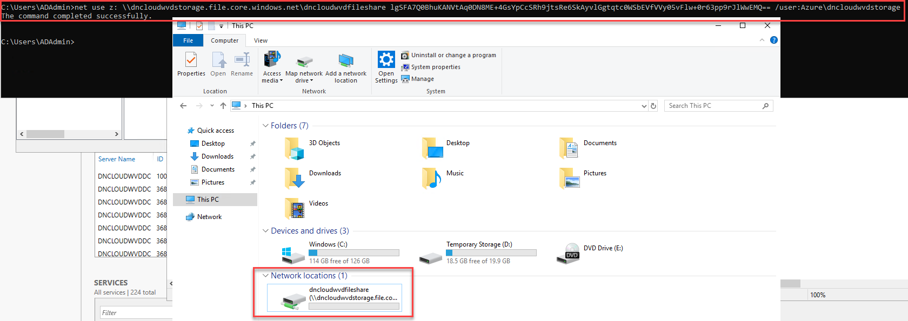

7.  Open **File Explorer**, right-click on the **Z:** drive and select **Properties**.

8.  On the properties window, select the **Security** tab and Select **Advanced**.

    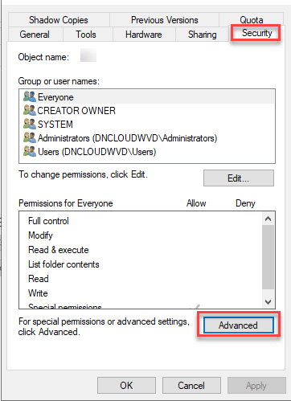

9.  Select **Add** and add each of the AD security groups you created in Task 4 with the appropriate permissions.  Select check names as each is entered to verify the connection.

    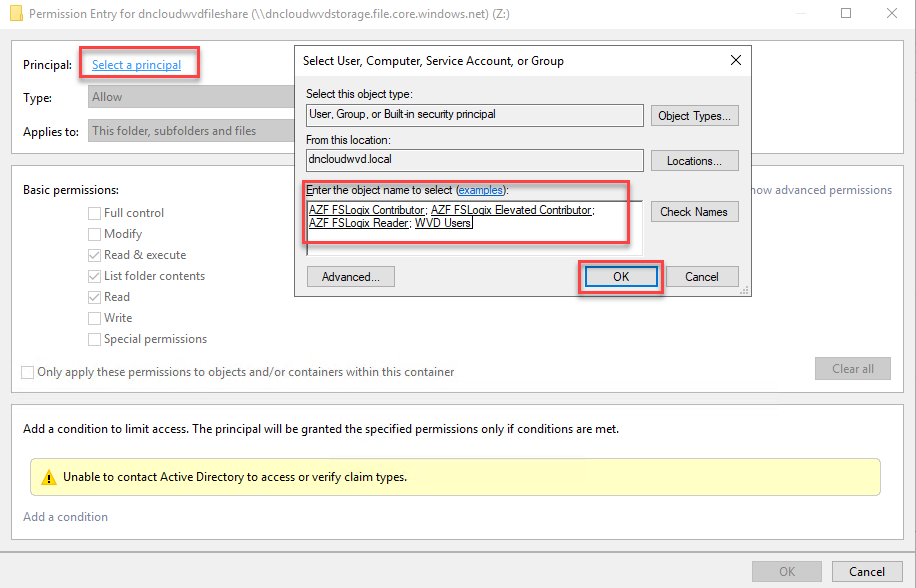

    >**Note**: The images shows all of the objects that need to be added but only one can be added at a time.  Add one and then repeat the process until all four are added.

10. Select **OK** to save your changes.

    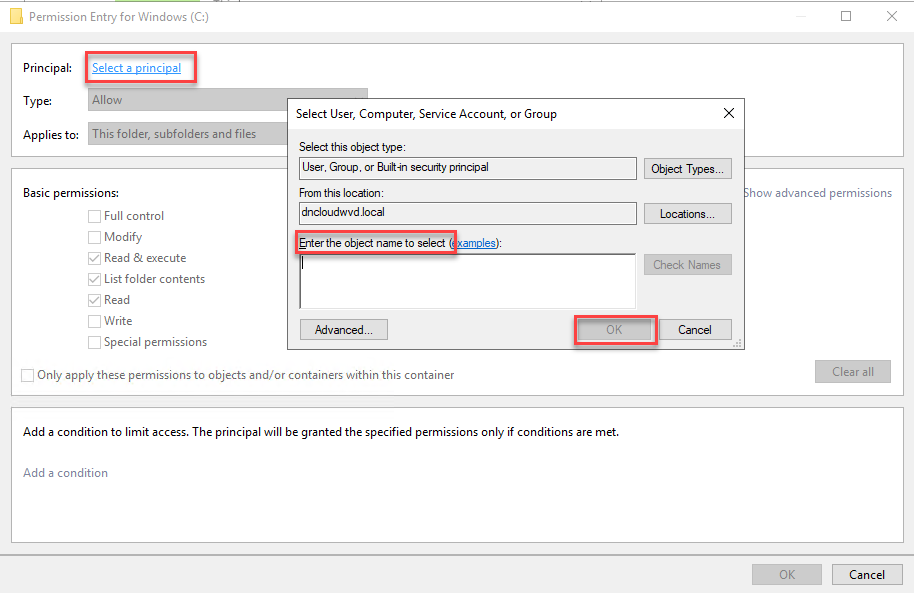

    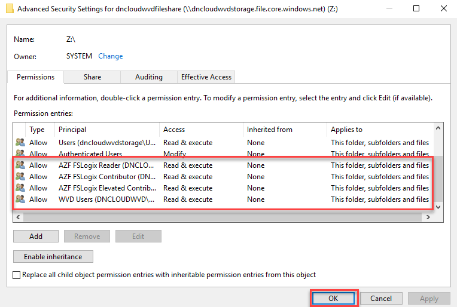


### Task 6: Configure NTFS permissions for the containers

With the NTFS permissions applied at the root file share, you can now create the FSLogix folder structure and recommended NTFS permissions. There are many ways to create secure and functional storage permissions for use with Profile Containers and Office Container. Below is one configuration option that provides new-user functionality and doesn't require users to have administrative permissions.

In this task we will create directories for each of the FSLogix profile types and assign the recommended permissions.

1.  Navigate to the networked drive in File explorer

    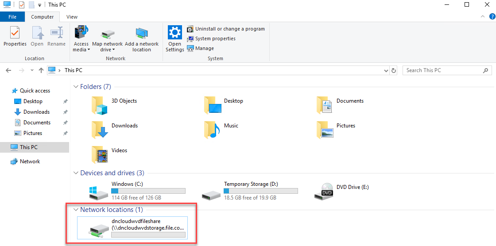

2.  Create three new folder directories in the root share.

    -    **Profiles**

    -    **ODFC**

    -    **MSIX**

    

3.  Right-click on the **Profiles** directory and select **Properties**.

4.  On the properties window, select the **Security** tab and Select **Advanced**.

5.  Select **Disable inheritance** and select **Remove all inherited permissions from this object**.

    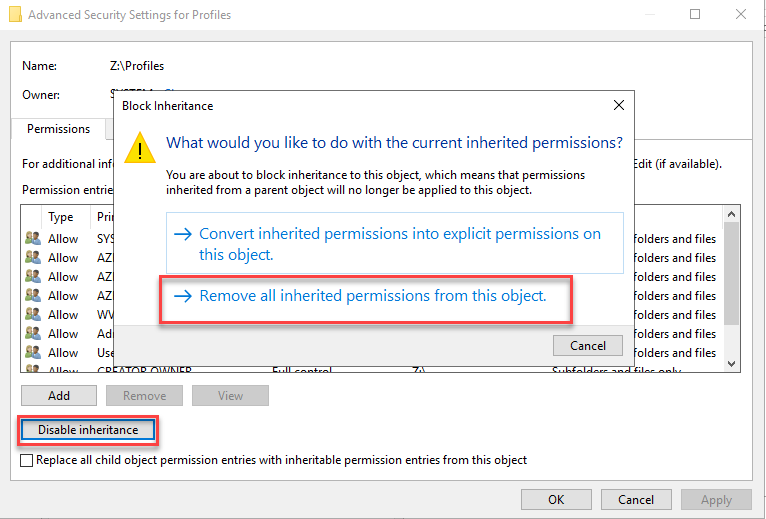

6.  Select **Add** and add **AZF FSLogix Elevated Contributor**. Grant **Full Control** and check **Only apply these permissions to objects and/or containers within this container**. Select **OK**.

    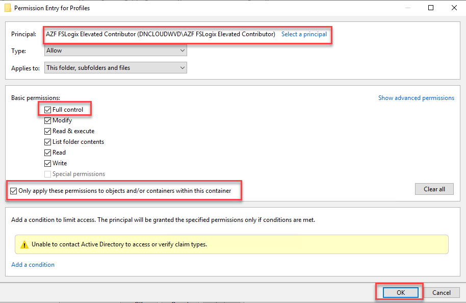

7.  Select **Add** and add **Creator owner**. Grant **Full Control** to **Only apply these permissions to objects and/or containers within this container**. Select **OK**.

    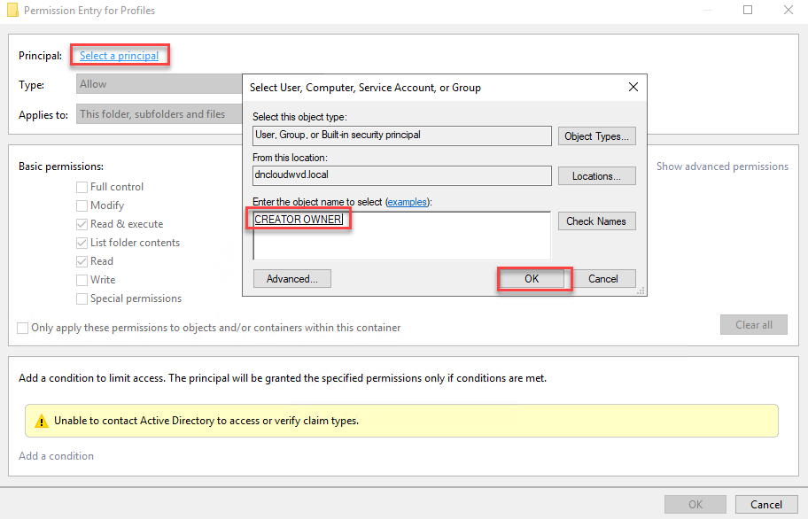

    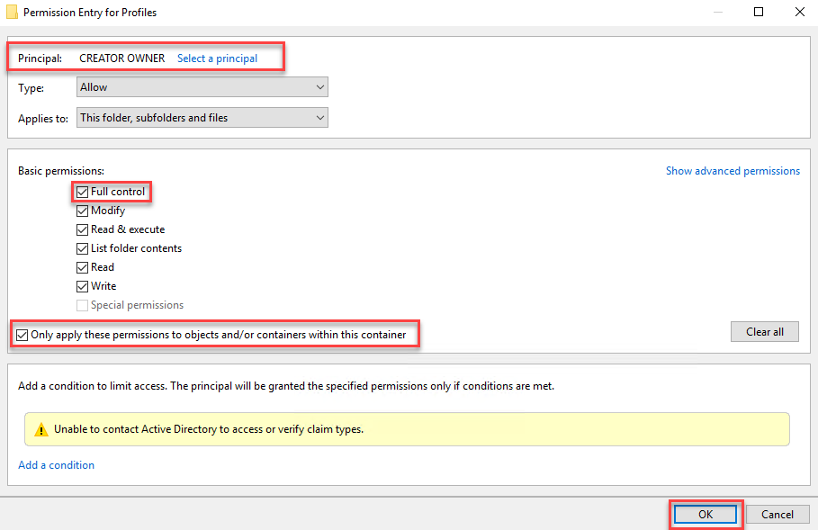

8.  Select **Add** and add **WVD Users**. Grant the following special permissions to **Only apply these permissions to objects and/or containers within this container**. Select **OK**.

    -   Traverse folder / execute file

    -   List folder / read data

    -   Read attributes

    -   Create folders / append data

    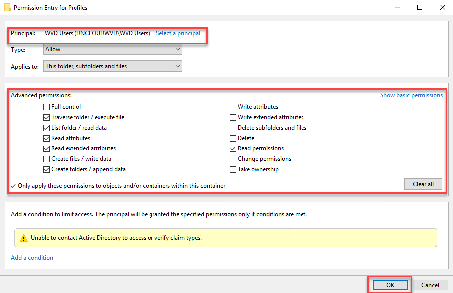

9.  Select **OK** on both property windows to apply your changes.

    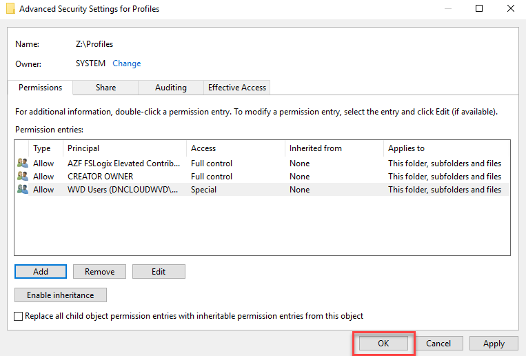

10. Repeat steps 3-9 for the **ODFC** directory.

11. Right-click on the **MSIX** directory and select **Properties**.

12. On the properties window, select the **Security** tab and Select **Advanced**.

13. Select **Disable inheritance** and select **Remove all inherited permissions from this object**.

    

14. Select **Add** and add **AZF FSLogix Elevated Contributor**. Grant **Full Control** to **Only apply these permissions to objects and/or containers within this container**. Select **OK**.

    

15. Select **Add** and add **WVD Users**. Grant **Read & execute** to **Only apply these permissions to objects and/or containers within this container**. Select **OK**.

    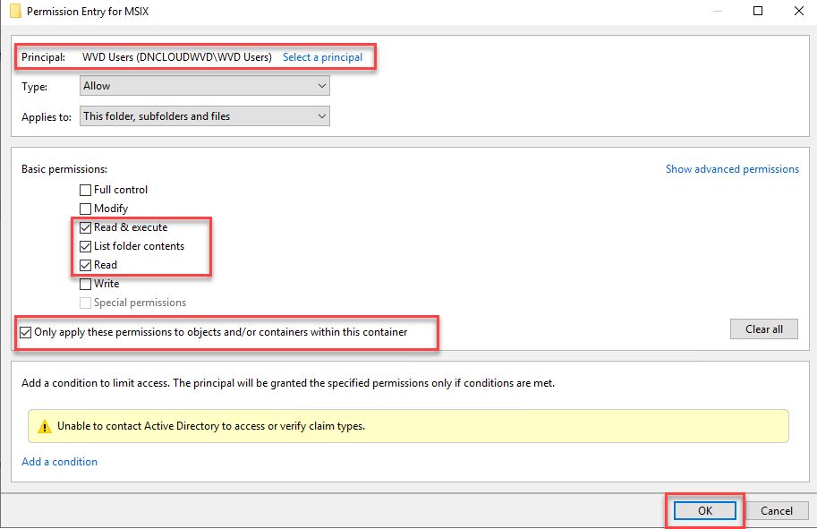

16. Confirm your permissions match the screenshots below.

17. Select **OK** on both property windows to apply your changes.

Your Azure Files Share is now ready for FSLogix profile containers. Copy the UNC path and add it to your FSLogix deployment (image, GPO, etc..).
