# Step 6: Create a master image for WVD (Part 1)

Duration:  30 minutes

In this exercise we are going to walk through the process of creating a master image for your WVD host pools. The basic concept for a master image is to start with a clean base install of Windows and layer on mandatory updates, applications and configurations. There are many ways to create and manage images for WVD. The steps covered in this exercise are going to walk you through a basic build and capture process that includes core applications and recommended configuration options for WVD.

**Additional Resources**

|                                                              |                                                              |
| ------------------------------------------------------------ | :----------------------------------------------------------: |
| Description                                                  |                            Links                             |
| Create a managed image of a generalized VM in Azure          | https://docs.microsoft.com/en-us/azure/virtual-machines/windows/capture-image-resource |
| For more information on how to deploy a virtual machine in Azure | https://docs.microsoft.com/en-us/azure/virtual-machines/windows/quick-create-portal |

For more information on how to setup a Bastion host in Azure|https://docs.microsoft.com/en-us/azure/bastion/bastion-create-host-portal|
  |              |            | 


### Task 1: Create a new Virtual Machine (VM) in Azure

1.  Sign in to the [Azure Portal](https://portal.azure.com/).

2.  On the Azure portal home page, Select **Create a resource**.

3.  On the New page, search for **Microsoft Windows 10**. Select **Windows 10 Enterprise multi-session, Version 1909** and Select **Create**.


    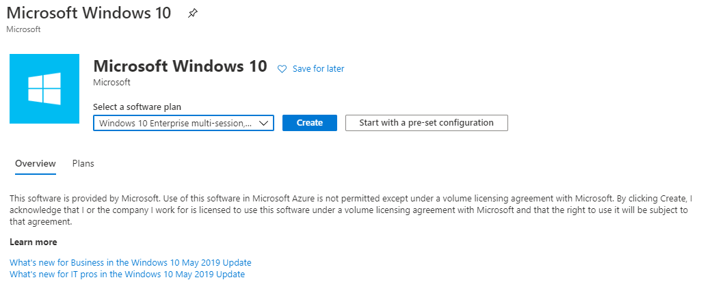
    
    >**Note**: In this exercise we are selecting a base Windows 10 image to start with, and installing Office 365 ProPlus using a custom deployment script. We are also using the latest available release of Windows 10 Enterprise multi-session, but you can choose the version based on your requirements.

4. On the Create a virtual machine page, fill in the required fields and create the VM by selecting **Review + create**.

   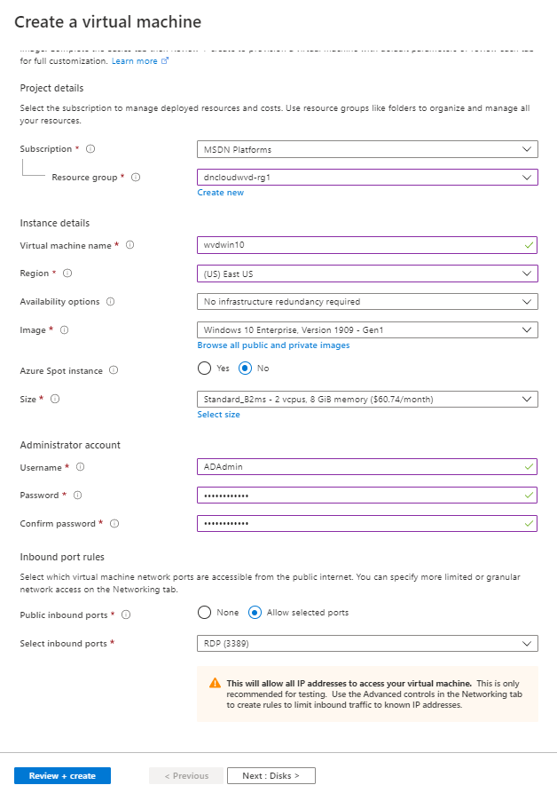

   >**Note**: Make a note of the **Username** and **Password** used to create the VM. This information will be required to access the VM after creation.

   >**Note**: This guide does not walk through the process of creating a VM in Azure. However, for **Inbound port rules**, be sure to allow **RDP (3389)** , or have a bastion host deployed for remote access.

   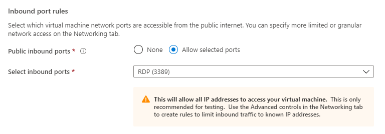

5. Once the VM is successfully deployed, go to the resource, and connect using RDP. Sign in using the credentials you supplied when creating the VM.

   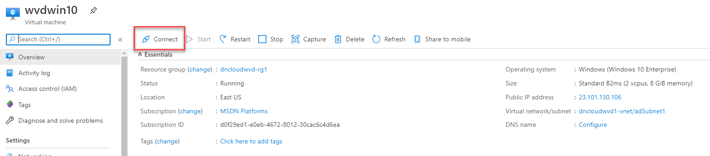

6. Download the RDP file and open the RDP file to connect.

   

### Task 2: Run Windows Update

Despite the Azure support teams best efforts, the Marketplace images are not always up to date. The best and most secure practice is to keep your master image up to date.

1. From your master image VM, open the **Settings** app and select **Updates & Security**.

   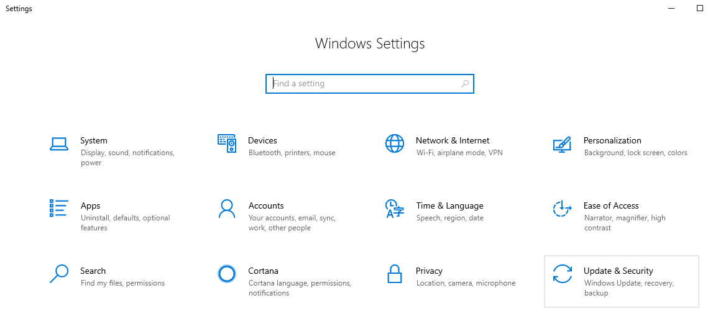

2. Install all missing updates, rebooting as necessary.

3. Once the VM is fully patched, the Windows Update Settings page should resemble the following screenshot.

   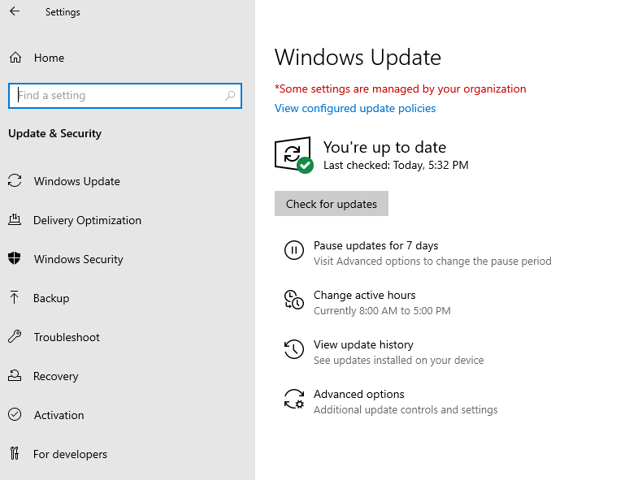

### Task 3: Prepare WVD image

**Introduction to the script**

The authors for this content have developed a scripted solution to assist in automating some common baseline image build tasks. The script includes a UI form, enabling you to quickly select which actions to perform. The end result will be a custom master image that incorporates Microsoft's main business applications, along with the necessary
policies and settings for an optimized user experience.

The script and related tools are maintained in GitHub - [Download Link](https://minhaskamal.github.io/DownGit/#/home?url=https://github.com/shawntmeyer/WVD/tree/master/Image-Build/Customizations) 

https://minhaskamal.github.io/DownGit/#/home?url=https://github.com/shawntmeyer/WVD/tree/master/Image-Build/Customizations 

For additional documentation about the script (e.g. parameters, functions, etc.), refer to the comments in **Prepare-WVDImage.ps1**.

For troubleshooting script execution, refer to the following log directory on the target machine: **C:\\Windows\\Logs\\ImagePrep**.

This script leverages the [Local Group Policy Object (LGPO)](https://docs.microsoft.com/en-us/windows/security/threat-protection/security-compliance-toolkit-10#what-is-the-local-group-policy-object-lgpo-tool) tool in the [Microsoft Security Compliance Toolkit (SCT)](https://docs.microsoft.com/en-us/windows/security/threat-protection/security-compliance-toolkit-10) to apply settings in the image. The settings are documented and exported on the target machine under **C:\\Windows\\Logs\\ImagePrep\\LGPO**. This approach was taken to simplify troubleshooting, enabling you to leverage Group Policy Results.

The UI form offers the following actions:

**Office 365 ProPlus**

-   Install the **latest** version of Office 365 ProPlus monthly channel.

-   Apply recommended settings.

-   Source documentation: [Install Office on a master VHD image](https://docs.microsoft.com/en-us/azure/virtual-desktop/install-office-on-wvd-master-image).

**OneDrive for Business**

-   Install the **latest** version of OneDrive for Business *per-machine*.

-   Source documentation: [Install Office on a master VHD image](https://docs.microsoft.com/en-us/azure/virtual-desktop/install-office-on-wvd-master-image).

**Microsoft Teams**

-   Install the **latest** version of Microsoft Teams *per-machine*.

-   Source documentation: [Use Microsoft Teams on Windows Virtual desktop](https://docs.microsoft.com/en-us/azure/virtual-desktop/teams-on-wvd).

**Microsoft Edge Chromium**

-   Install the **latest** version of Microsoft Edge Enterprise.

-   Apply recommended settings.

-   Source documentation: [Deploy Microsoft Edge using System Center Configuration Manager](https://docs.microsoft.com/en-us/deployedge/deploy-edge-with-configuration-manager).

**FSLogix Profile Containers**

-   Install the **latest** version of the FSLogix Agent.

-   Apply recommended settings.

-   Source documentation: [Download and Install FSLogix](https://docs.microsoft.com/en-us/FSLogix/install-ht).

**OS Settings**

-   Apply the recommended WVD settings for image capture.

-   Source documentation: [Prepare and customize a master VHD image](https://docs.microsoft.com/en-us/azure/virtual-desktop/set-up-customize-master-image).

-   Apply the recommended settings for capturing an Azure VM.

-   Source documentation: [Prepare a Windows VHD or VHDX to upload to Azure](https://docs.microsoft.com/en-us/azure/virtual-machines/windows/prepare-for-upload-vhd-image). 

-   Run Disk Cleanup.

-   Source documentation: [cleanmgr](https://docs.microsoft.com/en-us/windows-server/administration/windows-commands/cleanmgr). 

**Running the script**

1. [**Download**](https://minhaskamal.github.io/DownGit/#/home?url=https://github.com/shawntmeyer/WVD/tree/master/Image-Build/Customizations) the .zip file to your local workstation.

   https://minhaskamal.github.io/DownGit/#/home?url=https://github.com/shawntmeyer/WVD/tree/master/Image-Build/Customizations 

   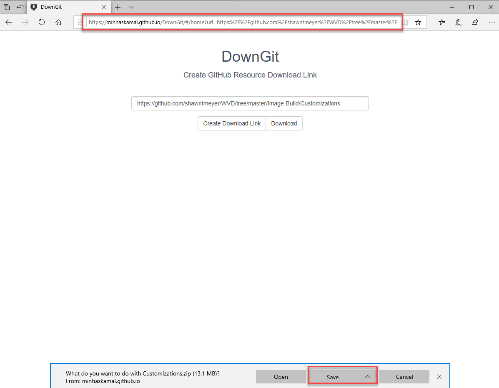

2. **Save** the .zip file on your local workstation. Open the RDP window to your master image VM. **Save as** the .zip file to the documents folder.

3. On the master image VM, right-click on the .zip file on your desktop and select **Extract All\...**.

   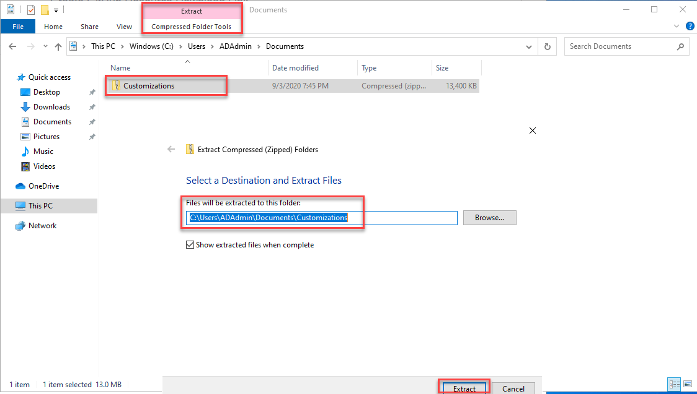

4. Extract the files to **C:\Documents**.

5. Open an elevated PowerShell window by searching for PowerShell on the Windows 10 VM. Right-click and run as administrator.

   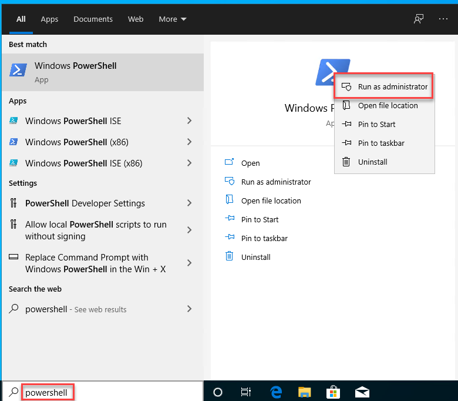

6. Navigate to \"C:\Users\\(loginaccount)\Documents\Customizations".

   ```
   cd C:\Users\(LoginAccount)\Documents\Customizations\Customizations
   ```

7. Run the following command to allow for script execution:

   ```
   Set-ExecutionPolicy -ExecutionPolicy Bypass -Scope Process -Force
   ```

8. Execute the script by running the following command:

   ```
   .\Prepare-WVDImage.ps1 -DisplayForm
   ```

   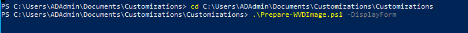

This will trigger the PowerShell form to launch. Select the appropriate options based on the following input information.

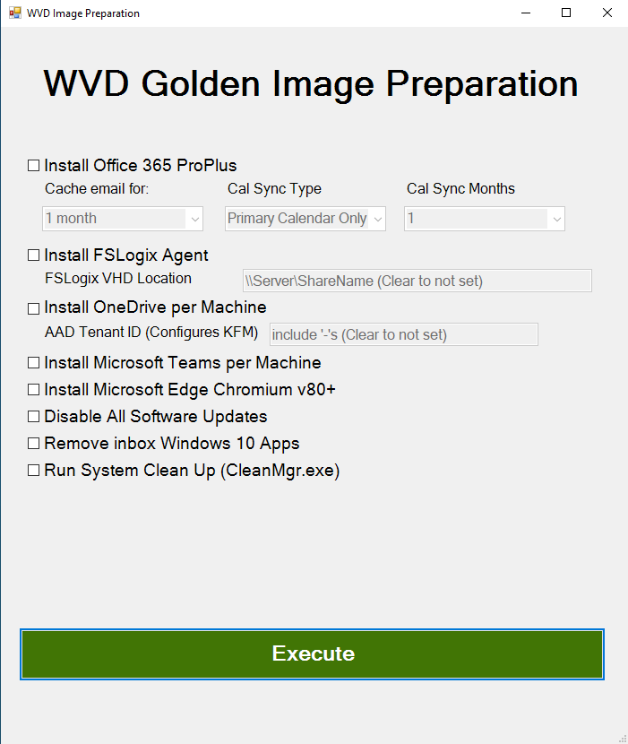

- Select **Install Office 365** to Install Office 365 ProPlus while excluding Teams, Groove and Skype. This will enable the Email and Calendar Caching settings below.

  >**Note**: Update these settings as necessary. The Microsoft recommended settings are pre-selected. If you do not wish to apply these settings to the image, then set each to \'Not Configured\'.

- Select **Install FSLogix Agent** to install the FSLogix Agent. If you select this option, the option to specify the FSLogix User Profile Container VHD Path is enabled. If you do not want to specify this option in the image, blank out this setting.

- Select **Install OneDrive per Machine** to install the OneDrive sync client per machine. If you select this option, it will enable the AAD Tenant ID field. Enter your tenant id here to enable silent Known Folder Move functionality in your image. If you do not want this in your image, blank out the value.

- Select **Install Microsoft Teams per Machine** to install the per machine Teams install.

- Select **Install Microsoft Edge Chromium v80+** to install the Microsoft Edge Enterprise browser based on Chromium.

- Select **Disable Windows Update** to disable Windows Update in the image.

- Select **Run System Clean Up (CleanMgr.exe)** to execute Disk Cleanup.

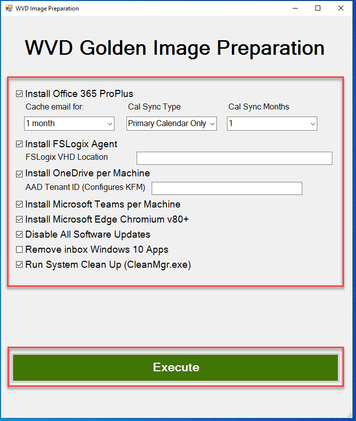

9. With the desired options selected, Select **Execute**.

   The form will close at this point and the script will begin configuring the image. **DO NOT close any of the remaining windows that appear until the script has finished execution**. Doing so will interrupt the process and will require you to start over.

   The script will take several minutes to complete depending on the options you selected. Additional input from you is not required during this stage, so feel free to minimize the RDP session and work on other tasks.

- If you selected to install Office 365, you will see a setup.exe window during execution.

- If you selected to install OneDrive, you will see a OneDrive window during execution.

- If you selected to run System Clean Up, you will see the Disk Cleanup wizard during execution. This window may stay on the \"Windows Update Cleanup\" task for a few minutes while it cleans out older files in the Windows Side by Side.

  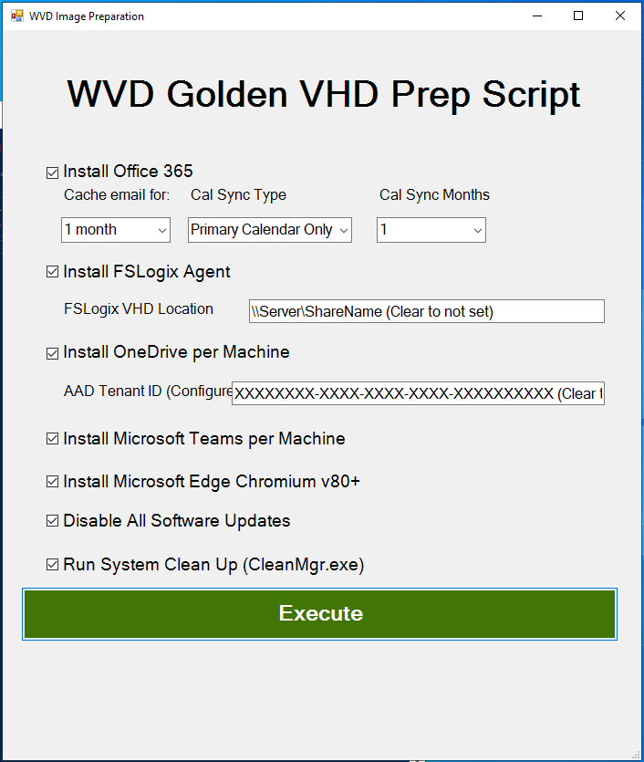

  >**Note**: This script takes some time to run, so be patient as it may seem like nothing is happening for a while, and then applications will begin to install. You can watch the status from within PowerShell. After the Disk Cleanup Wizard closes, you may notice the PowerShell window does not update. It is waiting for the cleanmgr.exe process to close, which can take some time. You can select the PowerShell window and continue to hit the up arrow on your keyboard until you are presented with an active prompt.

  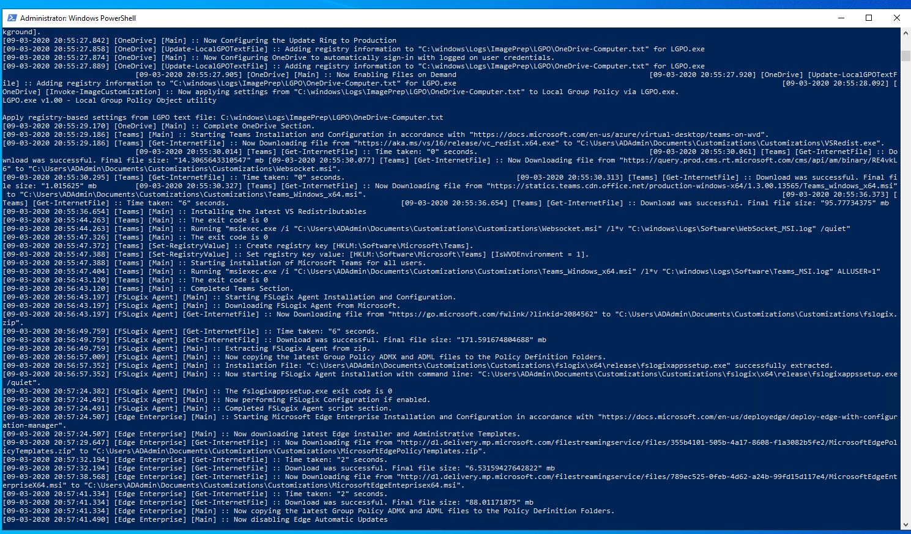
