# Step 5: Create a host pool and assign pooled remote apps.

Duration:  45 minutes

In this exercise we will be creating a non-persistent host pool for publishing remote apps. This enables you to assign users access to specific applications rather than an entire desktop. This type of application deployment serves many purposes and is not new to WVD, but has existed in Windows Server Remote Desktop Services for many years.

>**Note: Please place all additional resources in the original Resource Group you created, and be sure to specify the same Azure Region as in Step 1.

**Additional Resources**

|                                                  |                                                              |
| ------------------------------------------------ | :----------------------------------------------------------: |
| Description                                      |                            Links                             |
| Publish built-in apps in Windows Virtual Desktop | https://docs.microsoft.com/en-us/azure/virtual-desktop/publish-apps |
| Manage app groups with the Azure portal          | https://docs.microsoft.com/en-us/azure/virtual-desktop/manage-app-groups |
|                                                  |                                                              |

### Task 1: Create a new host pool and workspace

1. Sign in to the [Azure Portal](https://portal.azure.com/).

2. Search for **Windows Virtual Desktop** and select it from the list.

   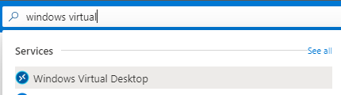

3. Under Manage, select **Host pools** and Select **+ Add**.

   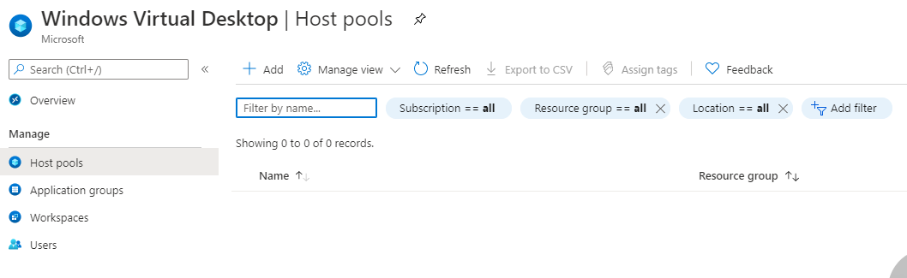

4. On the Basics page, refer to the following screenshot to fill in the required fields. Selecting **Pooled** for host pool type. Once complete, Select **Next: Virtual Machine**.

   

5. When you configure **Virtual machine settings**, select **Image Type: Gallery** and then select **Windows 10 Enterprise multi-session, Version 20H2 + Microsoft 365 Apps** for **Image**

   When you configure **Location** please use the same Azure Region as in Step 1

   When you configure **Number of Servers** please specify 2

   When you configure **Virtual Network** please specify the vnet that was created in Step 1 it should end with wvd1-vnet

   When you configure **Domain Administrator** please specify the adadmin account using the format you specified in Step 1 Ad Domain Name

   WHen you configure **Virtual Machine Administrator account** please specify username localadm and the same strong password you have been using

   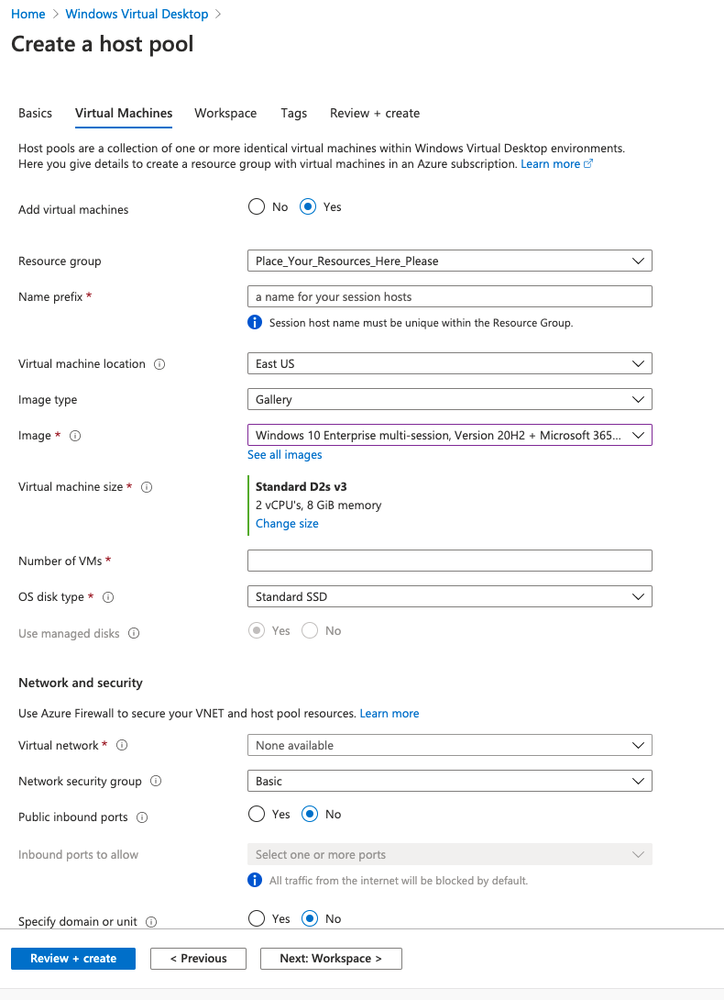

   >**Note**: Selecting this image is very important. You will need the Microsoft 365 for assigning apps in this exercise.

6. On the Workspace page, select **Yes** to register a new desktop app group. Select **Create new** and provide a **Workspace name**. Select **OK** and **Review + create**.

   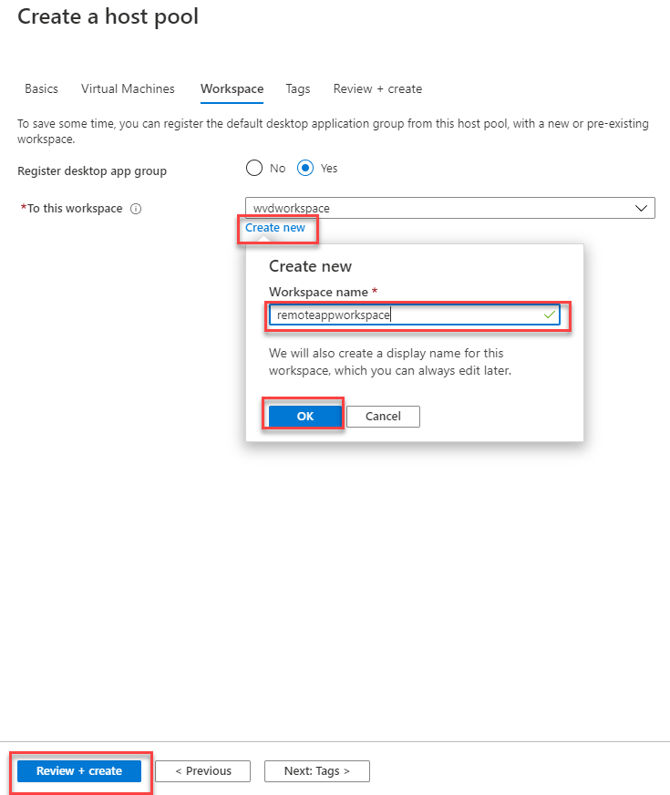

7. On the Create a host pool page, Select **Create**.

### Task 2: Create a friendly name for the workspace

The name of the Workspace is displayed when the user signs in. Available resources are organized by Workspace. For a better user experience, we will provide a friendly name for our new Workspace.

1. Sign in to the [Azure Portal](https://portal.azure.com/).

2. Search for **Windows Virtual Desktop** and select it from the list.

   

3. Under Manage, select **Workspaces**. Locate the Workspace that was created for remote apps and Select on the name.

   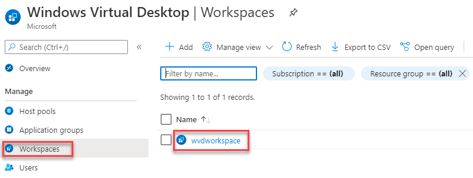

4. Under Settings, select **Properties**.

5. Update the **Friendly name** field to your desired name.

   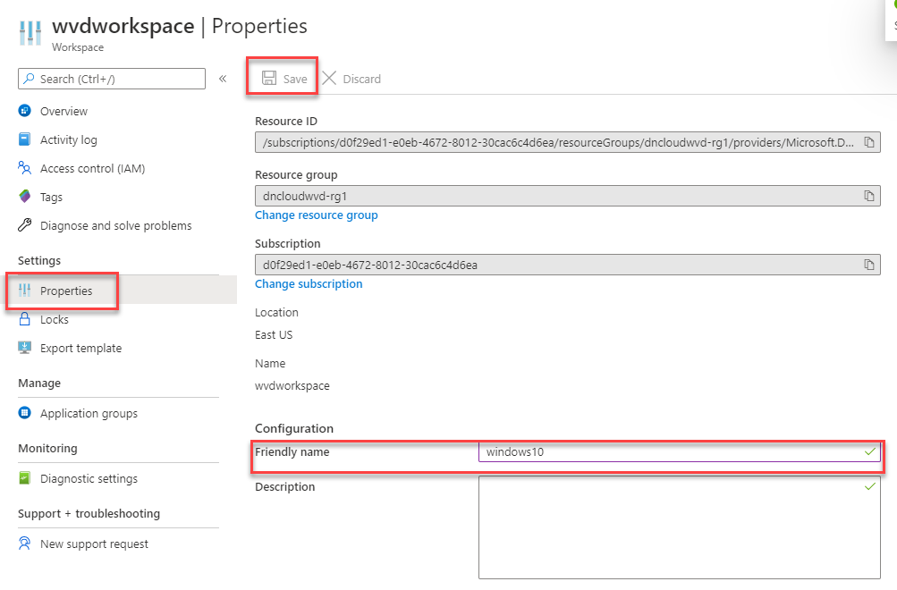

6. Select **Save**.

   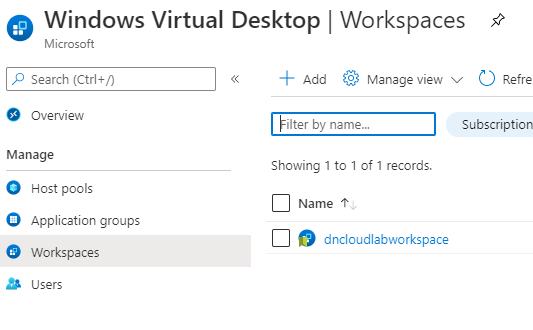

### Task 3: Add Remote Apps to your Host Pool

1. Sign in to the [Azure Portal](https://portal.azure.com/).

2. Search for **Windows Virtual Desktop** and select it from the list.

3. Under Manage, select **Host pools** and select the host pool that you created in Task 1.  Select **Application groups** and select **Add** to create a new application group.

   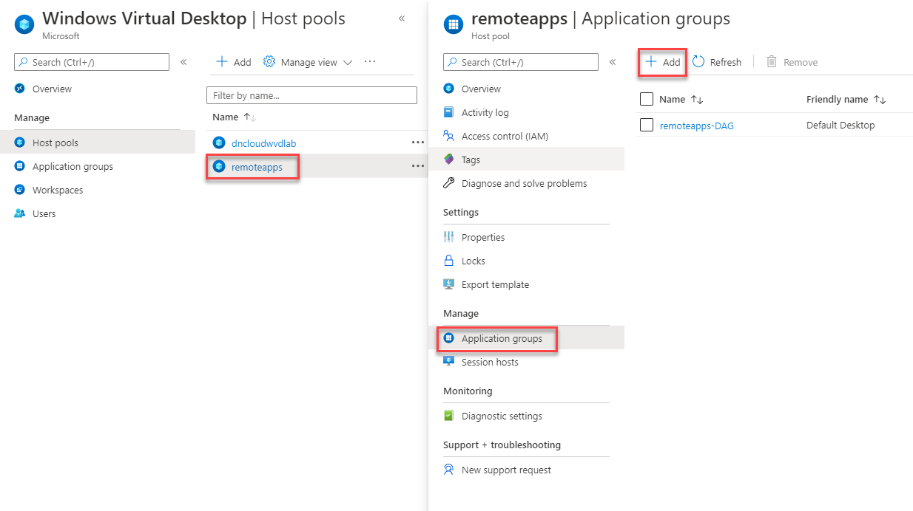

4. In the Basics tab, name the application group and select **Next: Assignments**.

   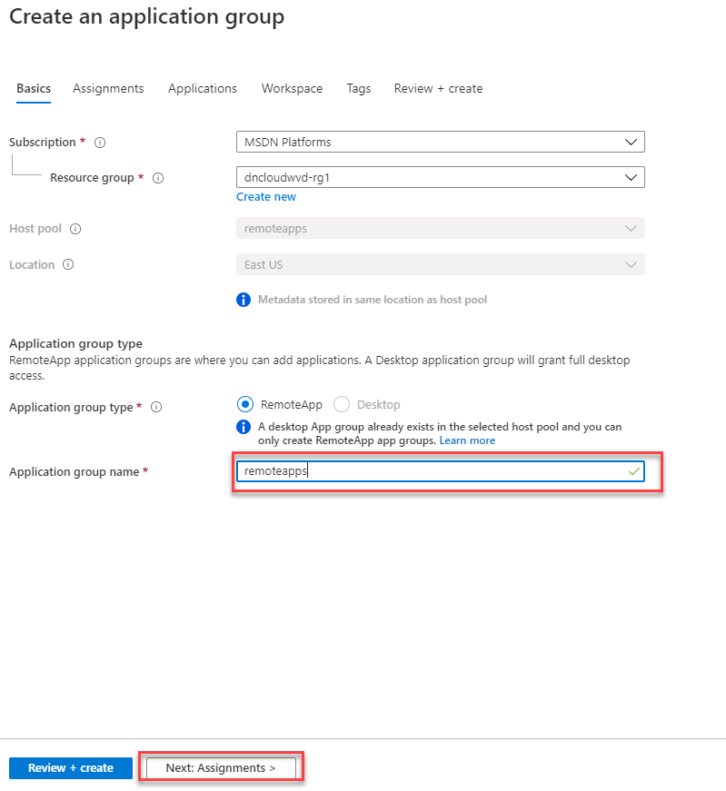

5. On the assignments tab, select **Add assignments**.  Search for the **WVD Remote App All Users** and **AAD DC Administrators** created earlier in this guide and choose **Select**.  

   >**Note**: AAD DC Administrators will allow you to use your Azure tenant login to access resources in Exercise 7.

6. Select **Next: Applications**.

   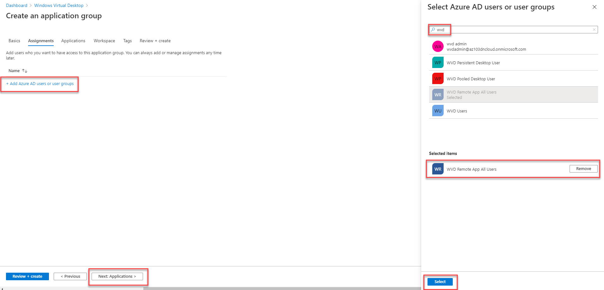

7. On the Applications page, Select **+ Add Application**.

8. On the Add Application fly out, next to Application source, select **Start Menu**. add the following applications, Selecting **Save** between selections.

   - Outlook

   - Microsoft Edge

   - Microsoft Teams

   - Word

   - PowerPoint

   - Excel

   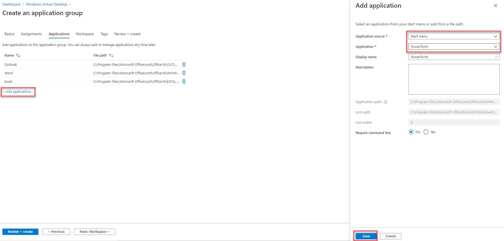

   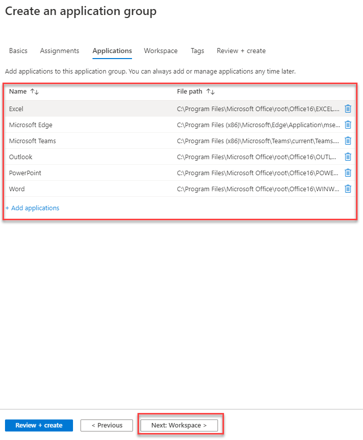

9. Select **Next: Workspace**.

10. On the Workspace page, select **Yes** to register the application group.

    >**Note**: The **Register application group** field will automatically populate with the workspace name.

11. Select **Review + Create**.

    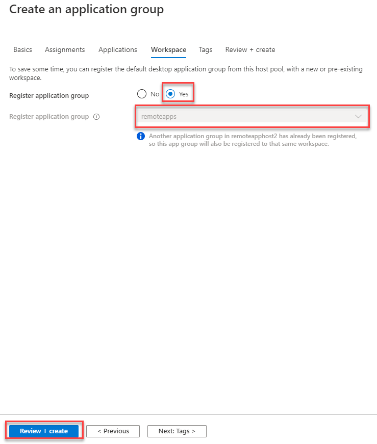

12. Select **Create**.

You have successfully created a Remote App non-persistent Host Pool with published apps. You can validate this configuration when we connect to the environment in a later exercise.
